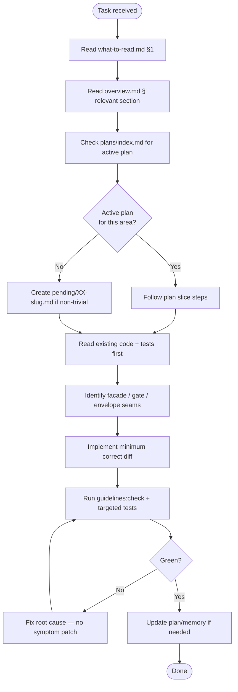
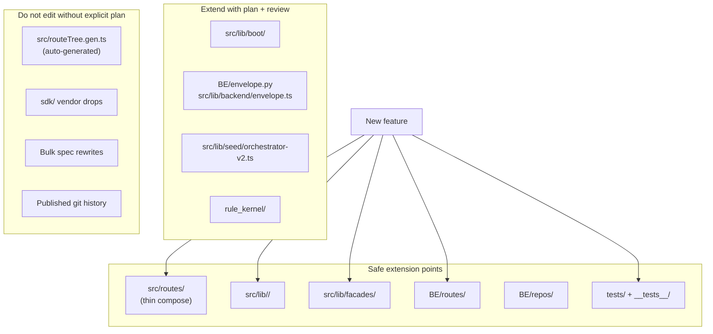

# AI Improvement Guidelines — Codebase-Derived

**Version:** 1.0.0  
**Created:** 2026-08-17  
**Audience:** AI agents (Cursor, Lovable, CI bots) and human reviewers  
**Source:** Deep read of `src/`, `BE/`, `app/`, `spec/`, `.lovable/`, recent plans (86, 88, 90, 96, 98), and CHANGELOG  
**Companion:** [Project overview](./overview.md) · [what-to-read.md](./what-to-read.md) · [coding-guidelines.md](./coding-guidelines.md)

---

## Purpose

This document answers three questions for every AI session:

1. **What is already good** — patterns to copy, not reinvent
2. **What still needs improvement** — concrete, codebase-evidenced gaps
3. **How to execute better** — step-by-step rules that go beyond generic "write clean code"

Treat this as **binding guidance** alongside `.lovable/coding-guidelines.md` and `spec/02-coding-guidelines/`. When they conflict, the stricter rule wins.

---

## Part A — What the codebase does well (preserve these)

### A.1 Root-cause discipline in shipped work

Recent CHANGELOG entries (Plan 90 Steps 72–89) demonstrate the gold standard:

- One-sentence **root cause** before every fix
- **Minimum correct fix** called out explicitly
- **Deliberately out of scope** listed so the next agent doesn't duplicate work
- Verification command + pass count recorded

**AI rule:** Every non-trivial fix MUST follow this template in commit/CHANGELOG prose. Symptom patches without root cause are auto-reject.

### A.2 Envelope-first HTTP integration

The FE moved from reading `env.Data` (always undefined) to `Results[0]` (Plan 90 Step 85). This class of bug — wire shape drift — is now guarded by:

- Zod schemas in `src/lib/backend/envelope.ts`
- Contract tests in `tests/contract/test_be_spine.py`
- `BackendHttpError` with correlation ID propagation

**AI rule:** Never add a new BE endpoint without: (1) envelope wrapper, (2) FE Zod parse, (3) at least one contract test row.

### A.3 Seed/backend duality with explicit write gate

`runBackendWrite` in `src/lib/data-source/gate.ts` is the single seam for mutations. Seed mode returns simulated results; backend mode calls real HTTP.

**AI rule:** Any new mutating feature MUST use `runBackendWrite` or document why it is read-only in seed mode. Never call `fetchBackend` directly for writes from UI components.

### A.4 Facade boundaries at two layers

| Layer       | Contract                                     | Location                           |
| ----------- | -------------------------------------------- | ---------------------------------- |
| Vendor SDK  | `CameraFacade`, `StorageFacade`, `SdkFacade` | `BE/sdk_facade/`                   |
| Domain seed | `DomainFacade<T>`                            | `src/lib/facades/domain-facade.ts` |

**AI rule:** New persistence slice → implement facade first, register in `facade-migration-policy.md`, add ratchet test. Never import `sdk/` from routes or components.

### A.5 Boot orchestration extracted (Plan 98)

`src/routes/__root.tsx` was decomposed into:

```
src/lib/boot/
  install-global-errors.ts
  seed-orchestration.tsx
  root-providers.tsx
  root-shell-layout.tsx
```

**AI rule:** Do not re-inline boot logic into `__root.tsx`. New global providers go in `root-providers.tsx`; new boot effects go in `seed-orchestration.tsx`.

### A.6 Observability as a vertical slice

Plan 90 built a complete stack: BE disk tail → SSE endpoint → same-origin proxy → `useSessionLogTail` → auto-reconnect → `LogTailViewer` → route mount → sessions table deep-links → URL-persisted filters → saved views.

**AI rule:** When adding operator-facing diagnostics, follow the same vertical slice pattern: BE contract → server fn/proxy → hook → component → route → E2E test.

### A.7 Typed enums over string unions

`.lovable/strictly-avoid.md` and Plan 43/91 enforced `*Type` suffix enums everywhere. Real registries live in `src/lib/constants/` and `src/types/`.

**AI rule:** Never introduce `"a" | "b"` unions. Create `FooType.ts` with PascalCase members.

---

## Part B — What needs improvement (evidence-based)

### B.1 Dual-backend confusion persists

**Evidence:** `BE/` (FastAPI) and `app/` (supervisor pipeline) both contain rule logic. Runtime map § Gaps notes UI rarely calls supervisor directly.

**Improvement for AI:**

1. Before editing rules, read [`docs/architecture/runtime-map.md`](../docs/architecture/runtime-map.md) ownership matrix
2. Setup/CRUD → `BE/routes/rules.py` + repos
3. Live evaluation → `rule_kernel/` (shared) + `app/worker/`
4. Never duplicate predicate math — add parity test if two paths must exist temporarily

### B.2 Large component files remain

**Evidence:** Plan 98 fixed `__root.tsx` (~762 → ~120 lines). `ProjectEditorSections.tsx` and other editor panels may still exceed 100-line component cap.

**Improvement for AI:**

1. Before adding logic to a route or component, check line count (`wc -l` or IDE)
2. If file > 200 lines, extract to `src/lib/<domain>/` or `src/components/<area>/sections/` first
3. Route files should compose; they should not contain business logic

### B.3 Facade migration is mid-flight

**Evidence:** `facade-migration-policy.md` — 7 slices still `facade-preferred` (store fallback when profile null).

**Improvement for AI:**

| Slice status       | Allowed in new code                     |
| ------------------ | --------------------------------------- |
| `facade-only`      | Facade imports only — no `useXStore`    |
| `facade-preferred` | `useFacadeOrStore(facade, () => store)` |
| `store-only`       | Store only until plan migrates          |

Check policy before every feature touching: projects, rulesets, rules, categories, cameras, micSettings.

### B.4 Plan-step comments go stale

**Evidence:** Files contain `// Plan 86 Step 30` while envelope shape changed in Plan 88/90.

**Improvement for AI:**

- Do **not** add new plan-step inline comments to production code
- Put traceability in CHANGELOG + plan closeout memo
- When editing a file heavily, remove stale plan comments if the referenced step is completed and behavior changed

### B.5 Spec vs code drift

**Evidence:** Shell spec describes Tauri; code uses Chromium MV3. Some `spec/21-app/` docs still say "spec only, no code."

**Improvement for AI:**

1. Read `spec/21-app/shell/03-implementation-status.md` before shell work
2. If spec contradicts code, trust **code + runtime-map** for implementation; file app-issue for spec update
3. Do not implement from stale spec sections without verifying in repo

### B.6 Client-side logging is ad hoc

**Evidence:** Widespread `console.info/warn` — good for breadcrumbs (Plan 90 pattern) but no unified pipeline.

**Improvement for AI:**

- Keep `console.warn` on every failure path with structured object `{ operation, ...context }`
- Use consistent prefix: `[moduleName]` e.g. `[bootReconcile]`, `[observability.sessions]`
- Never silent catch — match Plan 90 observability convention

### B.7 Integration tests thinner than unit tests

**Evidence:** ~224 unit test files vs handful of contract/E2E spine tests.

**Improvement for AI:** For any new BE route + FE consumer pair, add one row to `tests/contract/test_be_spine.py` or colocated integration test. Minimum: happy path + one error code.

---

## Part C — Mandatory AI workflow (every task)



### C.1 Read order (minimum)

1. [what-to-read.md](./what-to-read.md) — section 1 + task-specific row from section 3
2. [overview.md](./overview.md) — sections 2–4 if touching architecture
3. [memory/01-code-red.md](./memory/01-code-red.md)
4. Active plan in `.lovable/plans/pending/` OR completed plan for your area
5. Relevant spec under `spec/21-app/` or `spec/03-error-manage/`

### C.2 Before writing code

- [ ] Identified canonical owner (runtime-map) for this concern
- [ ] Checked facade-migration-policy for data slice status
- [ ] Confirmed error path uses envelope + typed code
- [ ] Confirmed no magic strings (enum or constant)
- [ ] Confirmed function ≤ 15 lines, no nested if

### C.3 After writing code

```bash
bun run guidelines:check          # FE
pytest BE/tests/<relevant> -q     # BE
pytest tests/contract/ -q         # if HTTP touched
```

---

## Part D — Architecture improvement checklist

Use when designing a new feature or refactoring.

### D.1 Frontend

| Check            | Requirement                                                           |
| ---------------- | --------------------------------------------------------------------- |
| Route thin?      | Business logic in `src/lib/`, not route file                          |
| Data path clear? | Facade / store / backend — one primary path documented                |
| Seed safe?       | Reads work offline; writes gated via `runBackendWrite`                |
| Errors surfaced? | Query meta `hasVisibility: false` only when intentionally local       |
| A11y?            | `aria-label`, keyboard path, 40px hit targets on interactive controls |
| Types?           | Zod at boundary; no `any`; enums with `Type` suffix                   |

### D.2 Backend (BE/)

| Check         | Requirement                                              |
| ------------- | -------------------------------------------------------- |
| Thin handler? | Route → repo/facade → envelope                           |
| SDK isolated? | Only `BE/sdk_facade/` touches vendor                     |
| Errors typed? | `AppError(ErrorCode.E_*, ...)` — never raw HTTPException |
| Logged?       | JSON log with CorrelationId, operation, code             |
| Tested?       | pytest for success + 400 + 404 paths                     |

### D.3 Runtime (app/)

| Check                  | Requirement                                         |
| ---------------------- | --------------------------------------------------- |
| Hot path non-blocking? | Capture never waits on worker                       |
| One writer?            | Respect split-DB ownership                          |
| Crash recovery?        | Reclaim inflight on boot; supervisor restart policy |
| Rule eval canonical?   | Use shared kernel — no duplicate predicates         |

---

## Part E — Code quality rules (observed violations to avoid)

These are the **most frequently violated** guidelines relative to the actual codebase state.

### E.1 Size caps

| Artifact             | Cap          | Waiver                           |
| -------------------- | ------------ | -------------------------------- |
| Function body        | 15 lines     | `// lint-allow: function-length` |
| React component file | 100 lines    | Split into sections/             |
| Any source file      | 300 lines    | Extract modules                  |
| Route file           | Compose only | Boot logic → `src/lib/boot/`     |

### E.2 Boolean and condition style

```typescript
// ❌ Wrong
if (!response.ok) { ... }
if (!status) { ... }

// ✅ Correct
if (response.ok === false) { ... }
if (isEmpty) { ... }  // positively named
```

Use `KeyboardKeyType.isEnterOrSpace(key)` — never chain `||` on `e.key`.

### E.3 Envelope parsing

```typescript
// ❌ Wrong — old shape
const data = env.Data;

// ✅ Correct
const payload = env.Results[0];
if (env.Status.IsFailed === true) { ... }
```

Always check `Status.IsFailed` explicitly — never invert `IsSuccess`.

### E.4 Server functions (TanStack Start)

- Use `createServerFn` + `beFetch` for BE calls — not raw fetch from components
- Validate search params with `zodValidator` + `fallback()` — never closed `z.enum` without fallback (Plan 90 Step 87 lesson)
- SSR-safe: no `window`/`localStorage` in route loaders — use `useEffect` or server-safe guards

### E.5 Python BE

- Functions ≤ 15 lines per `spec/coding-guidelines/python.md`
- `ensure_correlation_id` on every handler response
- Return `envelope.to_wire()` — never raw dict
- No bare `except`; log with structured `extra=`

---

## Part F — Improvement backlog (prioritized for AI agents)

Ordered by impact. Tie to Plan 98 subtasks where applicable.

| Priority | Item                                                         | Owner action    | Status             |
| -------- | ------------------------------------------------------------ | --------------- | ------------------ |
| P0       | Rule engine parity tests between BE kernel and worker        | SS-05           | Verify tests exist |
| P1       | Complete facade-only migration for `facade-preferred` slices | SS-04           | In progress        |
| P1       | Split remaining god-components (>300 lines)                  | SS-03           | Partial            |
| P2       | Wire supervisor health to UI degraded banner                 | runtime-map gap | Open               |
| P2       | Resolve AI-01 shell choice (Tauri vs Chromium)               | spec issue      | Blocked on product |
| P3       | Reduce plan-step comment noise in source                     | This doc § B.4  | Ongoing            |
| P3       | Unified client log pipeline (optional)                       | Future plan     | Open               |

When picking up backlog items, create or extend a plan in `.lovable/plans/pending/` — do not drive-by refactor without plan coverage.

---

## Part G — Anti-patterns observed in past AI sessions

From `.lovable/memory/workflow/`, strictly-avoid.md, and CHANGELOG "not fixed (deliberate)" notes:

| Anti-pattern                             | Why it fails                        | Correct approach                               |
| ---------------------------------------- | ----------------------------------- | ---------------------------------------------- |
| Symptom patch without root cause         | Regresses next session              | One-sentence root cause first                  |
| `env.Data` or `{ok,data,error}` envelope | Wire shape changed                  | Use PascalCase `Results[0]`                    |
| `instanceof EnvelopeError` in server fn  | Vite bundles break instanceof       | `err.name === "EnvelopeError"`                 |
| Inventing vendor names in constants      | Conflicts with real `CaptureVendor` | Read `capture.shared.ts` first                 |
| Mass AST refactor                        | Breaks unrelated files              | Read `memory/13-avoid-blind-mass-refactors.md` |
| Skipping version bump + CHANGELOG        | Lovable sync breaks                 | Every ship: version + CHANGELOG entry          |
| Direct `sdk/` import in BE route         | Facade leak                         | `BE/sdk_facade/` only                          |
| New Zustand store for seeded slice       | Facade ratchet violation            | Implement `DomainFacade<T>`                    |
| Nested quick-action links in cards       | Ambiguous click targets             | Max 2 quick actions; stopPropagation           |
| URL state without `fallback()`           | Route crash on bad query            | Plan 90 Step 87 pattern                        |

---

## Part H — Diagram: where AI changes should land



---

## Part I — Verification matrix

| Change type     | Minimum verification                                       |
| --------------- | ---------------------------------------------------------- |
| FE component    | `bun run guidelines:check` + colocated test if logic moved |
| FE route        | Above + manual route load; Playwright if critical path     |
| BE route        | `pytest BE/tests/routes/test_<area>.py -q`                 |
| Envelope change | FE + BE contract tests + update both envelope modules      |
| Facade slice    | Ratchet test + update facade-migration-policy.md           |
| Migration SQL   | `app/core/io/migrations/` + pytest migrate tests           |
| Spec only       | Link check; no runtime verification required               |

---

## Part J — Related documents

| Document                                                                                     | When to read                       |
| -------------------------------------------------------------------------------------------- | ---------------------------------- |
| [overview.md](./overview.md)                                                                 | Product + architecture orientation |
| [what-to-read.md](./what-to-read.md)                                                         | Full onboarding map + playbooks    |
| [coding-guidelines.md](./coding-guidelines.md)                                               | Blind-follow hard rules            |
| [strictly-avoid.md](./strictly-avoid.md)                                                     | Forbidden patterns                 |
| [memory/01-code-red.md](./memory/01-code-red.md)                                             | Size caps + prohibitions           |
| [memory/24-coding-and-error-rulebook.md](./memory/24-coding-and-error-rulebook.md)           | Distilled spec/02 + spec/03        |
| [plans/architecture-and-code-observations.md](./plans/architecture-and-code-observations.md) | Aug 2026 audit snapshot            |
| [memory/features/facade-migration-policy.md](./memory/features/facade-migration-policy.md)   | Per-slice data path                |
| [docs/architecture/runtime-map.md](../docs/architecture/runtime-map.md)                      | BE vs app ownership                |

---

## Part K — Summary for agents (TL;DR)

**Do:**

- Read overview + what-to-read before coding
- Follow envelope, facade, and write-gate seams
- Root cause → minimum fix → verify → CHANGELOG
- Keep files small; extract early
- Add contract test for new HTTP surfaces

**Don't:**

- Duplicate rule logic across BE and app/
- Import vendor SDK directly
- Use string unions or magic strings
- Swallow errors or patch symptoms
- Re-inline boot logic into `__root.tsx`
- Trust stale spec over runtime-map + code

---

_Last updated: 2026-08-17 · Maintainer: update when a new recurring AI failure is discovered; add row to Part G and optionally to strictly-avoid.md_
