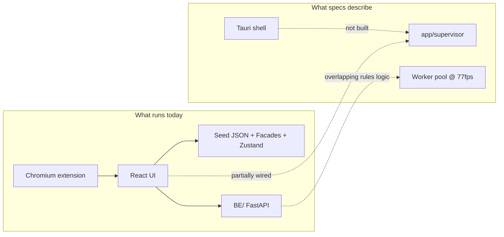

# Architecture and Code Observations

Here are my observations after reading the codebase — strengths, tensions, and what I’d watch going forward.

## Overall impression

This is a **spec-driven, multi-runtime vision inspection platform** built for long-term evolution, not a quick prototype. The architecture is thoughtful and often ahead of typical projects in error handling, boundary discipline, and test investment. The main cost is **complexity**: several overlapping systems are mid-migration, and the documentation sometimes describes a target state that the code hasn’t fully reached.

Rough scale: ~900 TypeScript files in `src/`, 224+ test files, two Python runtimes (`app/` + `BE/`), and a very large `spec/` tree.

## What works well

### 1. Clear separation of concerns (mostly)

The repo draws sensible boundaries:

| Layer  | Role                                            |
| ------ | ----------------------------------------------- |
| `src/` | Operator/engineer UI                            |
| `BE/`  | HTTP API for setup, rules, observability, CLI   |
| `app/` | High-speed capture → dispatch → worker pipeline |
| `sdk/` | Vendor drops, never touched directly            |

The **SDK facade rule** (`BE/routes` → `BE/sdk_facade`, never `sdk/`) and the frontend **domain facade contract** (`src/lib/facades/domain-facade.ts`) show real boundary thinking, not just folder naming.

### 2. Seed vs backend dual mode

Letting the UI run fully offline on JSON fixtures, then switch to a live backend with a health probe, is a strong pattern for an HMI:

- Designers and demos don’t need hardware or Python running
- Integration can be tested incrementally
- `runBackendWrite` in `src/lib/data-source/gate.ts` cleanly skips mutating calls in seed mode

That’s pragmatic architecture for a factory-floor app.

### 3. Error handling is first-class

Unlike many codebases where errors are an afterthought, this project treats them as core infrastructure:

- Typed `E_*` codes on both FE and BE
- Correlation IDs on every HTTP call
- 3-tier UI (toast → detail → full report)
- Query/mutation caches wired to global error surfacing in `src/router.tsx`
- “No swallowed catches” is enforced in guidelines and largely reflected in code

The PascalCase Universal Response Envelope (`Status/Attributes/Results/Errors`) is heavier than `{ ok, data, error }`, but it’s consistent and validated with Zod on the frontend.

### 4. Split DB + filesystem sync for the hot path

Using separate SQLite databases (RootDb, TaskDb, RulesDb) and atomic `.part` → rename for images is the right shape for 77 fps capture:

- No cross-DB joins on the hot path
- One writer per DB
- Immutable rule snapshots per run session
- Filesystem as the synchronization primitive instead of shared memory

That’s solid systems design for industrial vision.

### 5. Migration seams instead of big-bang rewrites

The v2 seed/facade work shows restraint:

- `useFacadeOrStore` lets legacy Zustand stores coexist with profile-scoped facades
- `getActiveProfile()` gates which data path wins
- Plan step comments trace _why_ code exists

That’s healthier than deleting old stores before the new path is proven.

### 6. Heavy quality infrastructure

Custom linters, magic-string checks, guideline docs, contract tests, Playwright E2E, visual regression — this team (human + AI) is trying to **encode conventions into tooling**, not rely on review alone. For a repo this size, that’s necessary.

## Architectural tensions and risks

### 1. Two backends, easy to confuse

There are really **two Python “backends”**:

1. **`BE/`** — FastAPI on `:8787` (rules CRUD, meta, observability, CLI)
2. **`app/`** — Supervisor + capture + dispatcher + workers (live inspection)

The UI talks to both concepts depending on mode and screen. The README explains this, but a newcomer will still wonder “which backend?” **`BE/app/rules/`** and **`app/rules/`** both exist — rule evaluation logic appears in both trees. That’s the biggest long-term maintenance risk: drift between HTTP-side evaluators and runtime-side evaluators.

### 2. Spec vs implementation gaps

Several specs describe a target that isn’t fully built:

| Spec says                                                  | Code says                                                |
| ---------------------------------------------------------- | -------------------------------------------------------- |
| Tauri/Rust shell with worker restart                       | Chromium MV3 extension (`chromium-shell/`)               |
| `AI-01` shell choice still open                            | Multiple shell docs coexist                              |
| BE README: “skeleton, NotImplementedError”                 | `BE/main.py` mounts many routers, real middleware, repos |
| Original envelope `{ok, data, error}` in Plan 88 changelog | Current `BE/envelope.py` uses PascalCase wire shape      |

The project is honest about this in plans and changelogs, but **onboarding friction** comes from reading specs that describe tomorrow while code reflects today.

### 3. Guideline violations in hot paths

The coding guidelines call for files < 300 lines and components < 100 lines. In practice:

- `src/routes/__root.tsx` — **~762 lines** (boot orchestration, seeding, error providers, shell chrome)
- `src/components/projects/ProjectEditorSections.tsx` — **~1,112 lines**

These aren’t cosmetic issues. The root route is doing too much: seed orchestration, project boot, error installation, and layout. That makes changes risky and tests harder to isolate. The guidelines exist for good reasons; the largest files are where bugs tend to cluster.

### 4. Transitional state complexity (facades + stores)

You’re mid-flight on:

- Legacy Zustand stores → v2 seed facades
- Seed profiles → `useFacadeOrStore` branching
- IndexedDB draft-save with boot reconcile

Each piece is reasonable alone. Together they create **three ways to read/write the same domain** (store, facade, backend). New features need a clear decision: “Does this slice use facade, store, or HTTP?” Without that, you get subtle bugs when the active profile is null vs set.

### 5. Plan-step archaeology everywhere

Comments like `// Plan 86 Step 30` are great for traceability but noisy in daily reading. Over time they become stale (Plan 88 Step 10 envelope vs current PascalCase envelope). I’d treat plan IDs as **changelog/metadata**, not permanent inline commentary, once a slice is merged.

### 6. Meta-repo weight

`.lovable/plans/`, `.lovable/memory/`, `mem/`, `spec/` (1,900+ markdown files), linter fixtures mirroring spec paths — the **process surface area** is enormous. It helps AI agents and serial execution, but humans pay a navigation tax. The README onboarding trail helps; still, “where is truth?” often means checking spec + plan + code + test together.

## Code quality observations

### TypeScript frontend

**Strengths:**

- Zod at HTTP boundaries (`EnvelopeSchema`, route validation)
- TanStack Router + Query used idiomatically
- Enum/type modules (`*Type.ts`) instead of stringly-typed constants
- Colocated `__tests__` near the code they protect
- Accessibility hooks (`LiveAnnouncer`, skip links, keyboard scopes)

**Weaknesses:**

- Some components accumulate business logic instead of delegating to `lib/`
- `console.info/warn` used for observability in many places — fine for dev, but no unified client-side log pipeline
- Route components sometimes work around TanStack outlet limitations with redirects in parent routes (documented, but a smell)

### Python backend

**Strengths:**

- Thin route handlers delegating to repos/facades
- `AppError` + central handlers — consistent error path
- Structured JSON logging with correlation context
- Tests lock envelope shape and status codes

**Weaknesses:**

- `BE/` grew beyond the “skeleton” story — docs need catching up
- Stub vs real provider status scattered (`meta.py` capabilities still say `"stub"` in places while repos exist)
- Two package layouts (`BE/` top-level routes vs `BE/app/` domain logic) mirror the dual-backend confusion

### Testing

Test breadth is a real strength: unit, contract, E2E, visual, hardware-flagged paths (`LOVABLE_HW_DAHENG=1`). The facade ratchet test (`facade-only-ratchet.step40.test.ts`) is a nice pattern — architecture enforced by test, not convention alone.

Gap: integration tests spanning **UI → BE → rule eval → envelope** end-to-end are harder to find than unit tests for each layer in isolation.

## Architecture diagram of the tension

The product vision is coherent; the **integration spine** (supervisor ↔ UI ↔ BE as one system) is still being assembled.

## What I’d prioritize (observations, not a mandate)

1. **Consolidate the “two backends” story** — one architecture doc that says which screens call `BE/`, which call `app/supervisor`, and where rule evaluation is canonical.
2. **Split `__root.tsx`** — extract boot/seed orchestration into `lib/boot/` or similar; keep the route file as composition only.
3. **Finish or freeze the facade migration** — pick a cutoff where new slices must use facades; deprecate store paths explicitly.
4. **Align BE README + meta capabilities** with what’s actually implemented — reduces false “stub” assumptions.
5. **Dedupe rule engines** — `BE/app/rules/` vs `app/rules/` is the highest drift risk; shared kernel or single owner would help.

## Bottom line

This is a **serious, well-architected industrial HMI codebase** with unusually strong error, boundary, and testing discipline. It reads like a project that was designed for AI-assisted serial delivery over many plans — which explains both its strengths (traceability, facades, spec coverage) and its costs (transitional layers, doc drift, large god-files, dual Python trees).

The architecture is **sound at the domain level** (split DB, multi-process capture, facade boundaries, seed/backend duality). The main work ahead is **integration and consolidation** — turning the spec’s full runtime picture into one coherent running system without three parallel data paths.
