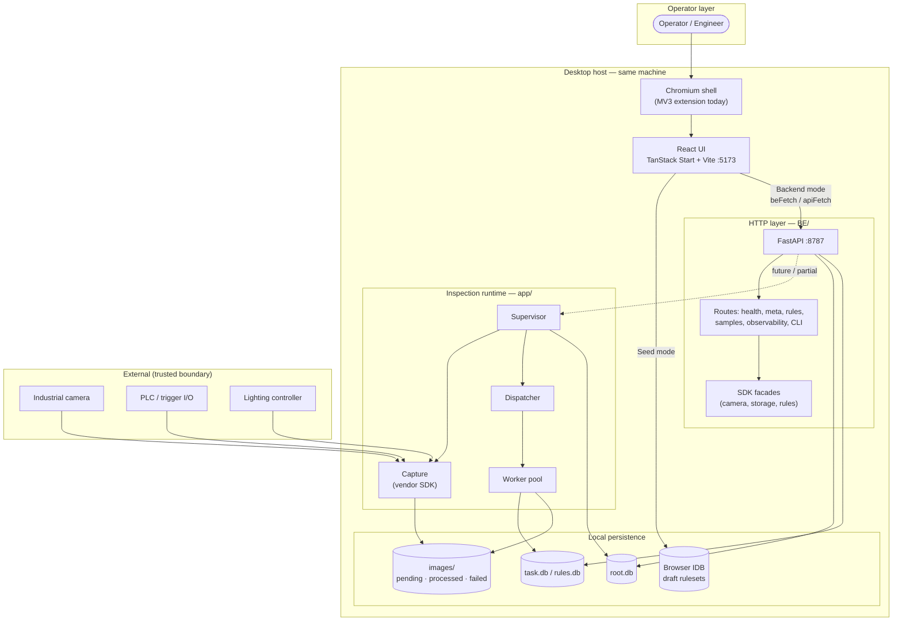
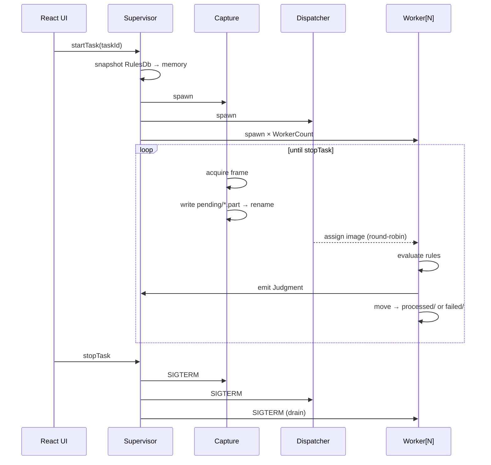
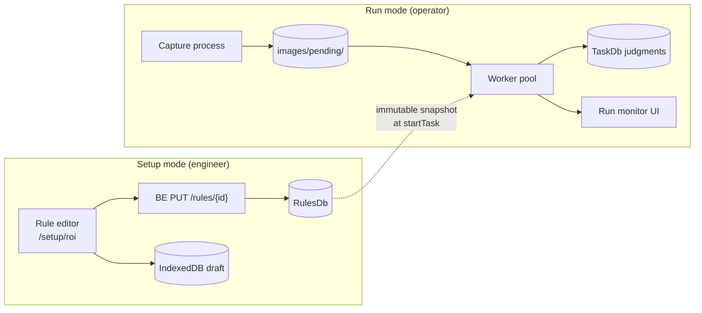

# Control Automation — Project Overview

**Version:** 1.0.0  
**Created:** 2026-08-17  
**Audience:** Human contributors, AI agents, reviewers  
**Status:** Living document — update when architecture or onboarding changes

---

## Start here

| If you are… | Read this first |
|-------------|-----------------|
| **Any contributor (human or AI)** | [`.lovable/what-to-read.md`](./what-to-read.md) — authoritative onboarding map |
| **New to the product** | This file (overview) → root [`README.md`](../README.md) |
| **About to write code** | [`.lovable/ai-improvement-guidelines.md`](./ai-improvement-guidelines.md) + [`.lovable/coding-guidelines.md`](./coding-guidelines.md) |
| **About to touch backend/runtime** | [`docs/architecture/runtime-map.md`](../docs/architecture/runtime-map.md) + [Architecture observations](./plans/architecture-and-code-observations.md) |
| **Looking for active work** | [`.lovable/plans/index.md`](./plans/index.md) |

---

## 1. What this project is

**Control Automation** is a **local-first factory-floor HMI** for camera-based vision inspection.

| Role | What they do |
|------|--------------|
| **Engineer** | Defines cameras, triggers, lighting, regions, rules, tolerances |
| **Operator** | Runs tasks, watches live counters and PASS/FAIL judgments |
| **Reviewer** (future) | Validates ambiguous failures via optional AI review |

**Domain vocabulary** (frozen):

```
Job → Task → Image → Region → Rule → Judgment → Result
```

**Non-goals for this pass:** multi-host cluster, remote operator client, mobile app, bulk cloud upload.

**Target OS:** Windows primary, Linux secondary.

---

## 2. System architecture (high level)



### Two data modes (central product decision)

| Mode | Mechanism | When to use |
|------|-----------|-------------|
| **Seed** | Local JSON fixtures, facades, Zustand stores, IndexedDB | Design, demos, offline UI work — **no Python required** |
| **Backend** | HTTP to `http://localhost:8787` (configurable) | Integration, real rules CRUD, observability, CLI |

Toggle: homepage or Settings → `DataSourceToggle`. Health probe before switch. URL persisted in `localStorage`.

**Write gate:** all mutating backend calls must pass `runBackendWrite` in `src/lib/data-source/gate.ts` so seed mode stays hermetic.

---

## 3. Process model (inspection runtime)

When a **Task** is running, four Python processes cooperate (see `spec/21-app/12-runtime-processes.md`):



**Hot-path rule:** capture never blocks on processing. Back-pressure surfaces as queue depth, not dropped frames.

**Sync primitive:** filesystem atomic rename (`.part` → final), not shared memory.

---

## 4. Repository map

| Path | Stack | Responsibility |
|------|-------|----------------|
| [`src/`](../src/) | React 19, TanStack Router/Query, Zustand, Tailwind v4, Zod | HMI UI (~900 TS/TSX files, ~70 routes) |
| [`BE/`](../BE/) | Python 3.11, FastAPI, pydantic | HTTP API: rules, samples, meta, observability, CLI, installer |
| [`app/`](../app/) | Python | Live pipeline: supervisor, capture, dispatcher, worker, audit |
| [`BE/app/`](../BE/app/) | Python | BE domain: rule kernel, installers, retention, facades |
| [`worker/`](../worker/) | Python uvicorn | Remote validation scorer (`POST /score`) for editor |
| [`sdk/`](../sdk/) | Vendor binaries | **Never edit in place** — wrap via `BE/sdk_facade/` |
| [`chromium-shell/`](../chromium-shell/) | MV3 extension | Desktop shell (spec target: Tauri — not built) |
| [`spec/`](../spec/) | Markdown | Source-of-truth specifications (~1900 files) |
| [`.lovable/`](./) | Markdown | Plans, memory, AI guidelines, prompts |
| [`tests/`](../tests/) | Vitest, Playwright, pytest | Unit, contract, E2E, visual (~224+ test files) |

### Frontend route groups

| Prefix | Purpose |
|--------|---------|
| `/` | Home, workflow cards, data-source toggle |
| `/projects/...` | Project → ruleset → rule editor |
| `/setup/...` | ROI editor, camera, categories, functions |
| `/settings/...` | Camera, lighting, trigger, license, shortcuts |
| `/cli/...` | Developer CLI observability |
| `/observability/...` | Sessions, runs, live tail, IPC traces |
| `/run`, `/results`, `/trial-run` | Operator run flows |

### Dual-backend mental model

| Layer | Path | Port | UI uses it for |
|-------|------|------|----------------|
| **HTTP API** | `BE/` | 8787 | Setup, rules CRUD, observability, CLI, health |
| **Inspection runtime** | `app/` | loopback supervisor | Live capture, dispatch, worker eval (partially wired to UI) |

Canonical map: [`docs/architecture/runtime-map.md`](../docs/architecture/runtime-map.md)

---

## 5. Data architecture

### Split SQLite (on disk)

| Database | Holds | Writer |
|----------|-------|--------|
| **RootDb** (`root.db`) | Jobs, tasks, run sessions, error events, settings | Supervisor |
| **TaskDb** (per task) | Images, regions, judgments (hot path) | Workers (serialized) |
| **RulesDb** (per task) | Rules, overrides, versioned snapshots | UI setup / BE |

Rules: one writer per DB; immutable rule snapshot per run session; PascalCase columns; no cross-DB joins on hot path.

Migrations: `app/core/io/migrations/{root,task,rules}/`

### Frontend persistence

| Store | Technology | Purpose |
|-------|------------|---------|
| Seed bundles | JSON + facades | Demo/fixture data (`src/lib/seed/`) |
| Draft rulesets | IndexedDB | Offline draft + boot reconcile |
| Backend URL / mode | localStorage | Data-source toggle |
| UI prefs | Zustand + localStorage | Theme, density, panel layout |

### Facade migration (v2 seed)

Legacy Zustand stores coexist with profile-scoped v2 facades via `useFacadeOrStore`. Policy: [`.lovable/memory/features/facade-migration-policy.md`](./memory/features/facade-migration-policy.md)

---

## 6. Error & envelope architecture

Every backend response uses the **Universal Response Envelope** (PascalCase):

```json
{
  "Status": { "IsSuccess", "IsFailed", "Code", "Message", "Timestamp" },
  "Attributes": { "RequestedAt", "HasAnyErrors", "IsSingle", ... },
  "Results": [ ... ],
  "Errors": { "Code", "BackendMessage", ... }
}
```

- Typed `E_*` wire codes on FE and BE
- `X-Correlation-Id` on every HTTP request
- 3-tier UI: compact toast → detail → full modal with backend logs
- No swallowed catches — spec: [`spec/03-error-manage/`](../spec/03-error-manage/)

FE adapter: `src/lib/backend/envelope.ts` · BE: `BE/envelope.py`

---

## 7. What is good about this codebase

These patterns are **worth preserving and extending** — they represent mature architectural choices, not accidents.

### 7.1 Spec-driven, plan-tracked delivery

- Behavior defined in `spec/` before or alongside code
- Serial plans in `.lovable/plans/` with subtask evidence
- Closeout memos in `.lovable/memory/v2/`
- Changelog entries cite plan step + root cause (excellent for audit)

### 7.2 Boundary discipline

- **SDK facade rule:** routes → `BE/sdk_facade/**`, never repo-root `sdk/`
- **Domain facade contract:** frozen `DomainFacade<T>` in `src/lib/facades/domain-facade.ts`
- **Write gate:** `runBackendWrite` keeps seed mode hermetic
- **Split DB:** performance and isolation by design

### 7.3 Error-first culture

- Global error store + QueryCache/MutationCache hooks in `src/router.tsx`
- `AppError` + central handlers in BE
- Envelope parsing failures surface as typed errors, not silent undefined
- Plan 90 observability work consistently logs `console.warn` breadcrumbs on failure paths

### 7.4 Migration seams (not big-bang rewrites)

- `useFacadeOrStore` — facades coexist with legacy stores
- Plan 98 god-file decomposition: `__root.tsx` reduced from ~762 → ~120 lines via `src/lib/boot/*`
- Envelope adapter preserves `_Legacy*` fields for lossless round-trip

### 7.5 Test investment

- ~224+ frontend test files (unit + component)
- Contract spine: `tests/contract/test_be_spine.py`
- E2E: Playwright smoke, data-source toggle, editor persistence
- Visual regression baselines
- Facade ratchet tests enforce architecture by CI

### 7.6 Operator-focused UX decisions

- Seed/backend toggle with health probe
- Observability: URL-persisted filters, server-side sort, cursor pagination, saved views, live SSE tail with auto-reconnect
- Ruleset draft conflict modal + boot reconcile (`runBootReconcile`)
- Density, hit-target, and a11y work (40px targets, `LiveAnnouncer`, keyboard scopes)

### 7.7 Quality tooling encoded in CI

- ESLint `--max-warnings=0`
- Magic-string checker
- Custom linter-scripts for spec cross-links, ui-backend-map, forbidden strings
- `guidelines:check` script bundles typecheck + lint + format

---

## 8. Known gaps & active improvement areas

Honest state as of Aug 2026 (post Plan 98 closeout):

| Area | Status | Reference |
|------|--------|-----------|
| Shell: Tauri vs Chromium | Spec says Tauri; code uses MV3 extension | `spec/21-app/shell/03-implementation-status.md` |
| UI ↔ supervisor direct wiring | Mostly routes through BE | `docs/architecture/runtime-map.md` § Gaps |
| Facade migration | Core slices `facade-preferred`; 6 slices `facade-only` | `facade-migration-policy.md` |
| God-files | `__root.tsx` fixed; some components still large | Plan 98 SS-03 |
| Rule engine | Shared `rule_kernel/` owner documented; verify parity tests | Plan 98 SS-05 |
| Spec tree size | ~1900 markdown files — high navigation cost | Use `what-to-read.md` trail |

Full audit: [`.lovable/plans/architecture-and-code-observations.md`](./plans/architecture-and-code-observations.md)  
Improvement plan (completed): [`.lovable/plans/completed/98-architecture-consolidation-improvements.md`](./plans/completed/98-architecture-consolidation-improvements.md)  
AI action items: [`.lovable/ai-improvement-guidelines.md`](./ai-improvement-guidelines.md)

---

## 9. Recently completed work (high-signal)

Plans marked **completed** in `.lovable/plans/completed/` that shaped today's architecture:

| Plan | Theme | Lasting impact |
|------|-------|----------------|
| **86** | UI v4 JSON seed facade | `DomainFacade<T>`, `bundle.v2.json`, `useFacadeOrStore`, 13 seed slices |
| **88** | BE v1 (150 steps) | FastAPI app, envelope, error codes, routes, SDK facade protocols |
| **90** | Worker & processing CLI | Observability stack, ruleset envelope save/reconcile, SSE log tail, installer |
| **96** | Guideline audit | Hundreds of file-level fixes across FE/BE |
| **98** | Architecture consolidation | Runtime map, doc alignment, god-file split, facade policy, integration spine |

Recent product features (from CHANGELOG v4.85–v4.98):

- Live log tail viewer with SSE proxy + auto-reconnect
- Observability sessions: server sort, cursor pagination, URL state, saved views
- Ruleset draft-save round-trip + boot reconcile + conflict modal
- Installer fingerprinting (SHA256, upgrade planner)
- Error toast compaction + dedupe + detail modal

---

## 10. Development workflow

### Quick start

```powershell
# Windows — all-in-one
.\run.ps1                  # BE :8787 + FE :5173 + Chromium shell
.\run.ps1 -NoShell         # Skip shell
```

```bash
# Manual
bun install && bun run dev --port 5173
cd BE && pip install -e ".[dev]" && uvicorn BE.main:app --port 8787
```

### Verification before PR

```bash
bun run guidelines:check    # typecheck + lint + format
pytest BE/ -q               # backend
bun run visual:test         # Playwright (when UI touched)
pytest tests/contract/ -q   # envelope spine
```

### Agent workflow

1. Read [what-to-read.md](./what-to-read.md) section 1
2. Check [plans/index.md](./plans/index.md) for active plan on your area
3. Follow [ai-improvement-guidelines.md](./ai-improvement-guidelines.md)
4. Implement in small slices with tests
5. Write closeout to `.lovable/memory/v2/` when plan completes

---

## 11. Diagram — data flow (setup vs run)



---

## 12. Cross-reference index

| Topic | Document |
|-------|----------|
| Onboarding map | [what-to-read.md](./what-to-read.md) |
| AI coding improvements | [ai-improvement-guidelines.md](./ai-improvement-guidelines.md) |
| Hard rules (CODE RED) | [memory/01-code-red.md](./memory/01-code-red.md) |
| Runtime ownership | [docs/architecture/runtime-map.md](../docs/architecture/runtime-map.md) |
| Facade policy | [memory/features/facade-migration-policy.md](./memory/features/facade-migration-policy.md) |
| Shell status | [spec/21-app/shell/03-implementation-status.md](../spec/21-app/shell/03-implementation-status.md) |
| Product spec | [spec/21-app/10-app-overview.md](../spec/21-app/10-app-overview.md) |
| Error manage | [spec/03-error-manage/00-overview.md](../spec/03-error-manage/00-overview.md) |
| Active/completed plans | [plans/index.md](./plans/index.md) |
| Root README | [README.md](../README.md) |
| Agent contract | [AGENTS.md](../AGENTS.md) |

---

## 13. Document maintenance

| When | Action |
|------|--------|
| New major plan completes | Add row to §9; update plans/index.md |
| Architecture changes | Update §2–§4; bump runtime-map `_Last Verified_` |
| New AI rule discovered | Add to ai-improvement-guidelines.md |
| Onboarding path changes | Update what-to-read.md + this §12 index |

_Last updated: 2026-08-17_
