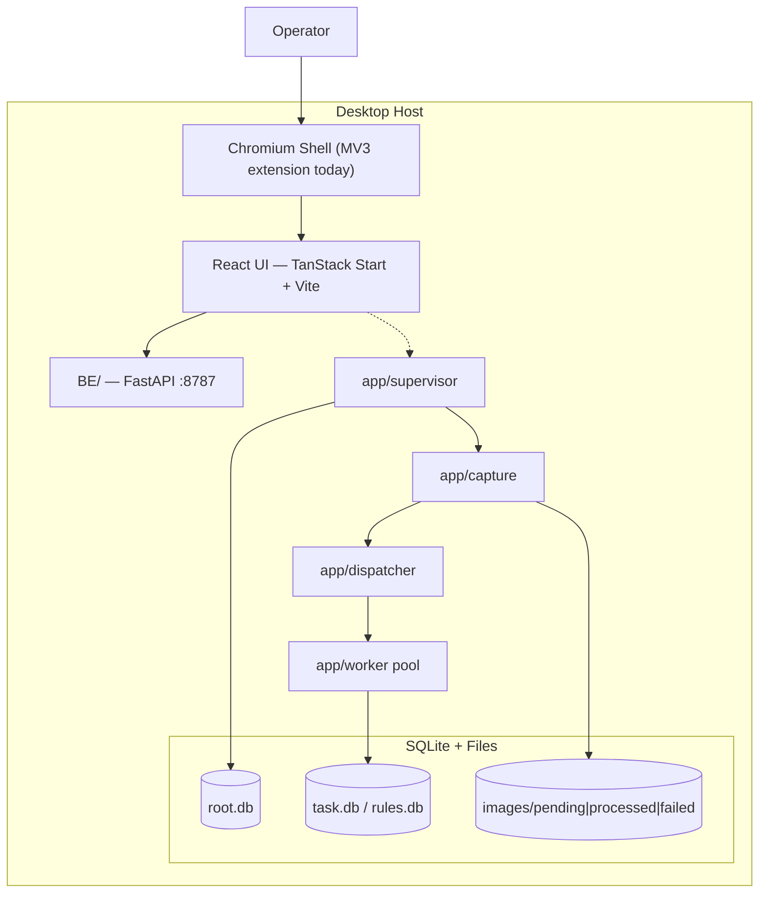
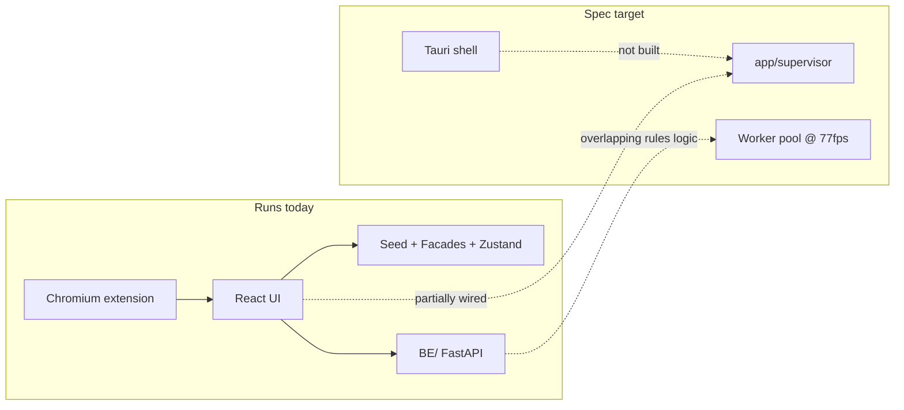

# Architecture & Code Observations

**Created:** 2026-08-13  
**Author:** Cursor agent (architecture review session)  
**Status:** Reference — Plan 98 completed (see `completed/98-architecture-consolidation-improvements.md`)  
**Scope:** Full repo — `src/`, `BE/`, `app/`, `spec/`, `.lovable/`, tests, shell

**Also see:** [`.lovable/overview.md`](../overview.md) (living project overview with diagrams) · [`.lovable/ai-improvement-guidelines.md`](../ai-improvement-guidelines.md) (AI action items)

---

## Purpose

Snapshot of architecture and coding quality as observed from a codebase read (Aug 2026). Use this file before starting Plan 98 subtasks or when onboarding a human contributor who needs the "honest state of the repo" beyond README marketing copy.

Companion executable plan: [`completed/98-architecture-consolidation-improvements.md`](./completed/98-architecture-consolidation-improvements.md) (done)

---

## 1. What This Project Is

**Control Automation** is a local-first factory-floor HMI for camera-based vision inspection:

- Engineers define regions, rules, cameras, lighting, triggers
- Operators run tasks and review PASS/FAIL judgments
- Target: sustained high-speed capture (spec: up to 77 fps) with evidence on disk

The repo is a **monorepo** with a React frontend, two Python layers (HTTP API + inspection runtime), vendor SDK drops, Chromium shell, and a very large spec tree.

---

## 2. Runtime Architecture (As Designed)

### Process model (spec/21-app/12-runtime-processes.md)

| Process     | Module                    | Role                                                   |
| ----------- | ------------------------- | ------------------------------------------------------ |
| Supervisor  | `app/supervisor/boot.py`  | Boots first, owns RootDb, spawns children              |
| Capture     | `app/capture/`            | Camera SDK, writes `images/pending/` via atomic rename |
| Dispatcher  | `app/dispatcher/`         | Queue watcher, assigns images to workers               |
| Worker pool | `app/worker/`             | Rule evaluation, judgments, image move                 |
| UI shell    | `chromium-shell/` (today) | Loads built UI, operator session                       |

Hot-path sync uses **filesystem `.part` → rename**, not shared memory.

---

## 3. Layer Inventory

| Path              | Stack                                                      | Role                                                               |
| ----------------- | ---------------------------------------------------------- | ------------------------------------------------------------------ |
| `src/`            | React 19, TanStack Router/Query, Zustand, Tailwind v4, Zod | HMI UI (~900 TS/TSX files)                                         |
| `BE/`             | Python 3.11, FastAPI, pydantic                             | HTTP API: rules, samples, meta, observability, CLI                 |
| `app/`            | Python                                                     | Live inspection pipeline (capture → dispatch → worker)             |
| `BE/app/`         | Python                                                     | Domain logic inside BE package (rules kernel, installers, facades) |
| `worker/`         | Python uvicorn                                             | Remote validation scorer for editor (`POST /score`)                |
| `sdk/`            | Vendor binaries                                            | Wrapped only via `BE/sdk_facade/**`                                |
| `chromium-shell/` | MV3 extension                                              | Desktop shell (spec target: Tauri — not built)                     |
| `spec/`           | Markdown                                                   | Source-of-truth specifications (~1900 files)                       |
| `tests/`          | Vitest, Playwright, pytest                                 | Unit, contract, E2E, visual (~224+ FE test files)                  |

---

## 4. Strengths (Keep Doing)

### 4.1 Boundary discipline

- **SDK facade rule:** `BE/routes/**` → `BE/sdk_facade/**`, never repo-root `sdk/`
- **Frontend domain facades:** frozen `DomainFacade<T>` contract in `src/lib/facades/domain-facade.ts`
- **Split DB:** RootDb / TaskDb / RulesDb — one writer each, no cross-DB joins on hot path

### 4.2 Seed vs backend dual mode

- UI runs fully on JSON fixtures (no backend) for design and demos
- `DataSourceToggle` probes health before switching to backend mode
- `runBackendWrite` in `src/lib/data-source/gate.ts` skips mutating calls in seed mode
- Strong pattern for factory-floor HMIs where hardware isn't always available

### 4.3 Error management as infrastructure

- Typed `E_*` codes on FE and BE
- Correlation IDs on every HTTP call (`X-Correlation-Id`)
- 3-tier UI: toast → detail modal → full report
- Query/mutation caches wired to global error surfacing in `src/router.tsx`
- PascalCase Universal Response Envelope validated with Zod (`src/lib/backend/envelope.ts`)

### 4.4 Migration seams (not big-bang rewrites)

- `useFacadeOrStore` — legacy Zustand stores coexist with v2 seed facades
- `getActiveProfile()` gates which data path wins
- IndexedDB draft-save with boot reconcile for rulesets

### 4.5 Quality infrastructure

- Custom linters, magic-string checks, guideline docs in `spec/02-coding-guidelines/`
- Contract tests, Playwright E2E, visual regression
- Facade ratchet tests (e.g. `facade-only-ratchet.step40.test.ts`)

### 4.6 Spec-driven delivery

- Plans in `.lovable/plans/`, closeouts in `.lovable/memory/`
- Plan step comments trace ownership (noisy but useful during active slices)

---

## 5. Tensions & Risks

### 5.1 Two backends — easy to confuse

| Layer              | Path   | Default port          | Used for                              |
| ------------------ | ------ | --------------------- | ------------------------------------- |
| HTTP API           | `BE/`  | 8787                  | Setup, rules CRUD, observability, CLI |
| Inspection runtime | `app/` | loopback (supervisor) | Live capture, dispatch, worker eval   |

**Risk:** `BE/app/rules/` and `app/rules/` both exist. Rule evaluation logic can drift between HTTP-side and runtime-side evaluators.

### 5.2 Spec vs implementation gaps

| Spec / doc says                                 | Code says                                           |
| ----------------------------------------------- | --------------------------------------------------- |
| Tauri/Rust shell with worker restart            | Chromium MV3 extension (`chromium-shell/`)          |
| `AI-01` shell choice still open                 | Multiple shell docs coexist                         |
| `BE/README.md`: "skeleton, NotImplementedError" | `BE/main.py` mounts many routers, middleware, repos |
| Plan 88 changelog: `{ok, data, error}` envelope | Current `BE/envelope.py`: PascalCase wire shape     |

Onboarding friction: specs often describe **target state** while code reflects **today**.

### 5.3 Guideline violations in hot paths

Coding guidelines (`spec/02-coding-guidelines/00-overview.md`):

- Files < 300 lines
- React components < 100 lines

Observed violations:

| File                                                | Lines (approx) | Problem                                                 |
| --------------------------------------------------- | -------------- | ------------------------------------------------------- |
| `src/routes/__root.tsx`                             | ~762           | Boot orchestration + seed + errors + shell in one route |
| `src/components/projects/ProjectEditorSections.tsx` | ~1,112         | Business logic + UI monolith                            |

These are where regressions cluster and tests are hardest to isolate.

### 5.4 Transitional data-path complexity

Three parallel ways to read/write the same domain:

1. Legacy Zustand stores (`src/lib/*/store.ts`)
2. v2 seed facades (`src/lib/facades/`, profile-scoped)
3. Backend HTTP (`src/lib/backend/http.ts`)

Without an explicit per-slice decision, bugs appear when `getActiveProfile()` is null vs set, or when seed/backend mode diverges.

### 5.5 Plan-step comment archaeology

Inline comments like `// Plan 86 Step 30` help traceability but:

- Clutter daily reading
- Go stale (e.g. Plan 88 Step 10 envelope vs current PascalCase shape)

Prefer changelog + plan closeout memos once a slice merges.

### 5.6 Meta-repo weight

`.lovable/plans/`, `.lovable/memory/`, `spec/`, linter fixtures mirroring spec paths — enormous process surface. Helps AI serial execution; humans pay navigation tax. "Where is truth?" often means spec + plan + code + test together.

---

## 6. Code Quality Observations

### 6.1 TypeScript frontend

**Strengths**

- Zod at HTTP boundaries
- TanStack Router + Query used idiomatically
- Enum modules (`*Type.ts`) instead of string unions (guideline-aligned)
- Colocated `__tests__`
- A11y hooks (`LiveAnnouncer`, skip links, keyboard scopes)

**Weaknesses**

- Some route/component files accumulate business logic instead of delegating to `lib/`
- `console.info/warn` used widely for observability — no unified client log pipeline
- Route workarounds for TanStack outlet limitations (documented in rule deep-link routes)

### 6.2 Python backend

**Strengths**

- Thin route handlers → repos/facades
- `AppError` + central handlers
- Structured JSON logging with correlation context
- Tests lock envelope shape and status codes

**Weaknesses**

- `BE/README.md` stale vs actual implementation depth
- Stub vs real provider status scattered (`meta.py` capabilities still `"stub"` in places)
- Two package layouts: `BE/routes/` vs `BE/app/` mirrors dual-backend confusion

### 6.3 Testing

**Strengths:** broad coverage — unit, contract, E2E, visual, hardware-flagged (`LOVABLE_HW_DAHENG=1`)

**Gap:** fewer integration tests spanning **UI → BE → rule eval → envelope** end-to-end than per-layer unit tests

---

## 7. Data & Storage

### Split DB (spec/05-split-db-architecture/)

| Database           | Holds                                             |
| ------------------ | ------------------------------------------------- |
| RootDb             | Jobs, tasks, run sessions, error events, settings |
| TaskDb (per task)  | Images, regions, judgments (hot path)             |
| RulesDb (per task) | Rules, overrides, versioned snapshots             |

Rules: one writer per DB; immutable rule snapshot per run session; PascalCase columns.

Migrations: `app/core/io/migrations/{root,task,rules}/`

### Frontend persistence

- Seed JSON bundles (`src/lib/seed/`)
- IndexedDB for draft ruleset save + boot reconcile
- `localStorage` for backend URL and data-source mode

---

## 8. Integration Spine (Today vs Target)

The product vision is coherent. The **integration spine** (supervisor ↔ UI ↔ BE as one system) is still being assembled.

---

## 9. Scale Snapshot (Aug 2026)

| Metric                      | Approx value                 |
| --------------------------- | ---------------------------- |
| `src/` TS/TSX files         | ~900                         |
| Test files (`*.test.ts(x)`) | ~224+                        |
| Route files                 | ~70                          |
| Spec markdown files         | ~1900                        |
| Python trees                | 3 (`app/`, `BE/`, `BE/app/`) |

---

## 10. Cross-References

| Topic                       | Location                                                                                                           |
| --------------------------- | ------------------------------------------------------------------------------------------------------------------ |
| Product overview            | `README.md`, `spec/21-app/10-app-overview.md`                                                                      |
| Runtime processes           | `spec/21-app/12-runtime-processes.md`                                                                              |
| Shell architecture (target) | `spec/21-app/shell/02-runtime-architecture.md`                                                                     |
| BE layout                   | `BE/README.md`                                                                                                     |
| Coding guidelines           | `spec/02-coding-guidelines/00-overview.md`                                                                         |
| Error envelope              | `spec/03-error-manage/`, `BE/envelope.py`, `src/lib/backend/envelope.ts`                                           |
| Facade backlog              | `.lovable/pending-facades/`                                                                                        |
| Improvement plans           | [`pending/98-architecture-consolidation-improvements.md`](./pending/98-architecture-consolidation-improvements.md) |

---

## 11. Summary Verdict

**Sound at the domain level:** split DB, multi-process capture, facade boundaries, seed/backend duality, error-first culture.

**Main work ahead:** integration and consolidation — one coherent running system, one canonical rule engine owner, docs aligned with code, god-files split, facade migration finished or frozen.
