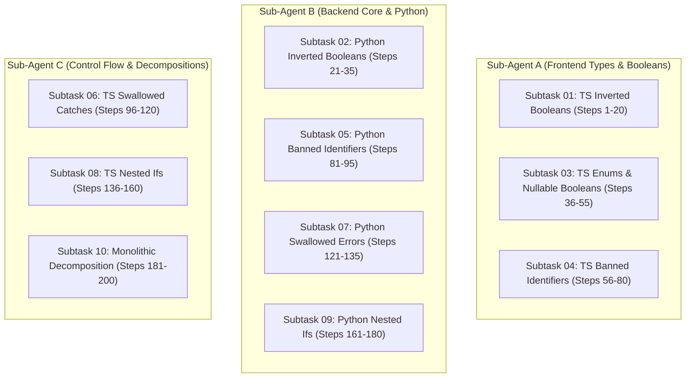

# Plan 01: Coding Guideline Audit & Enforcement (v4)

**Status:** pending  
**Version:** 4.0.0  
**Created:** 2026-08-23  
**Slug:** `01-coding-guideline-fixes`  
**Subtasks Directory:** [`.lovable/plans/subtasks/01-coding-guideline-fixes/`](file:///d:/wp-work/riseup-asia/cat-my/.lovable/plans/subtasks/01-coding-guideline-fixes/)  
**Target Codebase:** `src/` (Frontend, 1019 files), `BE/` & `app/` (Backend, 1187 files)

---

## 1. Executive Summary & Audit Overview

A comprehensive, automated 50-step deep audit was conducted across all TypeScript and Python source code files in the repository. The audit evaluated strict adherence to the project's non-negotiable coding guidelines, error management contracts, and type safety policies.

### Audit Summary Matrix

| Guideline / Rule Area | TypeScript (`src/`) | Python (`BE/` & `app/`) | Severity | Target Subtask |
| :--- | :--- | :--- | :--- | :--- |
| **Inverted Booleans (`!isX`, `!hasX`, `not is_x`)** | 174 occurrences | 35 occurrences | Critical | Subtask 01, 02 |
| **Banned Short Identifiers (`arr`, `cb`, `fn`, `el`, `msg`, `ctx`, `obj`, `val`)** | 506 occurrences | 59 occurrences | High | Subtask 04, 05 |
| **Enums Missing `Type`/`Category` Suffix** | 2 (`HtmlTag`, `ValidationStatus`) | 0 | Critical | Subtask 03 |
| **Nullable / Optional Booleans (`?: boolean`, `boolean \| null`)** | 147 occurrences | N/A | High | Subtask 03 |
| **Swallowed Errors / Silent Catches** | 285 occurrences | 18 occurrences | Critical | Subtask 06, 07 |
| **Nested `if` Statements** | 317 occurrences | 55 occurrences | Critical | Subtask 08, 09 |
| **File / Component Size Limits (>100/.tsx, >300/file)** | 257 files | 19 files | Medium | Subtask 10 |
| **Function Length Cap (>15 lines)** | Audited | 456 functions | Medium | Subtask 10 |

---

## 2. Root Cause Analysis & Blast Radius (Fallout Check)

### 2.1 Inverted Boolean Checks
- **Root Cause:** Standard JavaScript and Python negation idioms (`!isEnabled`, `not is_success`) were written without checking for explicit positive states or using explicit boolean comparison (`isEnabled === false`, `is_failure is True`).
- **Blast Radius & Fallout:** In UI conditional rendering, converting `!isX` to `isX === false` prevents rendering bugs where `undefined` could inadvertently be treated as false.
- **Remediation Strategy:** Replace negative checks with explicit comparisons (`=== false`) or extract positive helper booleans.

### 2.2 Enums Missing `Type` Suffix
- **Root Cause:** `HtmlTag` in `src/lib/enums/html.ts` and `ValidationStatus` in `src/lib/enums/validation.ts` were created before strict enum naming was established.
- **Blast Radius & Fallout:** Renaming these enums affects imports across routes and components. Must update all import statements and verify via `bunx tsgo --noEmit`.

### 2.3 Banned Short Identifiers
- **Root Cause:** Convenient lambda parameters (`(el) => ...`, `(fn) => ...`, `(ctx) => ...`) in map/filter callbacks.
- **Blast Radius & Fallout:** Renaming local lambda parameters is completely internal and has zero external blast radius.

### 2.4 Swallowed Errors & Silent Catches
- **Root Cause:** Defensive error handling in localStorage helpers and async UI mutations.
- **Blast Radius & Fallout:** Replacing empty catch blocks with structured warning logs (`console.warn('[OperationName]', { error: err })`) increases observability without breaking UI execution flow.

### 2.5 Nested `if` Statements
- **Root Cause:** Accumulation of sequential condition guards inside event handlers.
- **Blast Radius & Fallout:** Flattening nested `if` statements using guard clauses and early returns reduces cyclomatic complexity.

---

## 3. Subtask Distribution & Execution Architecture

The remediation plan is broken into **10 granular subtasks** containing **200 sequential execution steps**, specifically structured so that **3 concurrent sub-agents** can execute them safely without file conflicts.



---

## 4. Subtask Manifest & Cross-References

| Subtask | Slug | Steps | File Link |
| :--- | :--- | :--- | :--- |
| **01** | `01-ts-inverted-booleans` | Steps 1–20 | [01-ts-inverted-booleans.md](file:///d:/wp-work/riseup-asia/cat-my/.lovable/plans/subtasks/01-coding-guideline-fixes/01-ts-inverted-booleans.md) |
| **02** | `02-py-inverted-booleans` | Steps 21–35 | [02-py-inverted-booleans.md](file:///d:/wp-work/riseup-asia/cat-my/.lovable/plans/subtasks/01-coding-guideline-fixes/02-py-inverted-booleans.md) |
| **03** | `03-ts-enums-and-nullable-booleans` | Steps 36–55 | [03-ts-enums-and-nullable-booleans.md](file:///d:/wp-work/riseup-asia/cat-my/.lovable/plans/subtasks/01-coding-guideline-fixes/03-ts-enums-and-nullable-booleans.md) |
| **04** | `04-ts-banned-identifiers` | Steps 56–80 | [04-ts-banned-identifiers.md](file:///d:/wp-work/riseup-asia/cat-my/.lovable/plans/subtasks/01-coding-guideline-fixes/04-ts-banned-identifiers.md) |
| **05** | `05-py-banned-identifiers` | Steps 81–95 | [05-py-banned-identifiers.md](file:///d:/wp-work/riseup-asia/cat-my/.lovable/plans/subtasks/01-coding-guideline-fixes/05-py-banned-identifiers.md) |
| **06** | `06-ts-swallowed-catches-and-error-handling` | Steps 96–120 | [06-ts-swallowed-catches-and-error-handling.md](file:///d:/wp-work/riseup-asia/cat-my/.lovable/plans/subtasks/01-coding-guideline-fixes/06-ts-swallowed-catches-and-error-handling.md) |
| **07** | `07-py-swallowed-errors-and-except-handlers` | Steps 121–135 | [07-py-swallowed-errors-and-except-handlers.md](file:///d:/wp-work/riseup-asia/cat-my/.lovable/plans/subtasks/01-coding-guideline-fixes/07-py-swallowed-errors-and-except-handlers.md) |
| **08** | `08-ts-nested-ifs-and-guard-clauses` | Steps 136–160 | [08-ts-nested-ifs-and-guard-clauses.md](file:///d:/wp-work/riseup-asia/cat-my/.lovable/plans/subtasks/01-coding-guideline-fixes/08-ts-nested-ifs-and-guard-clauses.md) |
| **09** | `09-py-nested-ifs-and-guard-clauses` | Steps 161–180 | [09-py-nested-ifs-and-guard-clauses.md](file:///d:/wp-work/riseup-asia/cat-my/.lovable/plans/subtasks/01-coding-guideline-fixes/09-py-nested-ifs-and-guard-clauses.md) |
| **10** | `10-monolithic-functions-and-file-size-decomposition` | Steps 181–200 | [10-monolithic-functions-and-file-size-decomposition.md](file:///d:/wp-work/riseup-asia/cat-my/.lovable/plans/subtasks/01-coding-guideline-fixes/10-monolithic-functions-and-file-size-decomposition.md) |

---

## 5. Verification & Quality Gates

Each subtask must be verified using the following automated commands:

1. **Frontend Type & Lint Check:**
   ```bash
   bunx tsgo --noEmit
   bun run lint
   ```
2. **Backend Python Verification:**
   ```bash
   uvx ruff check BE/
   pytest BE/ -q
   ```
3. **Contract & Regression Tests:**
   ```bash
   pytest tests/contract/ -q
   bun run test
   ```

---

## 6. Execution Instructions for Sub-Agents

- When assigned a subtask, read the corresponding subtask file in `.lovable/plans/subtasks/01-coding-guideline-fixes/`.
- Execute each step sequentially, verifying changes after every modification.
- Maintain single-statement newline rules and zero-nesting invariants.
- Commit all changes upon completion of each subtask batch.
