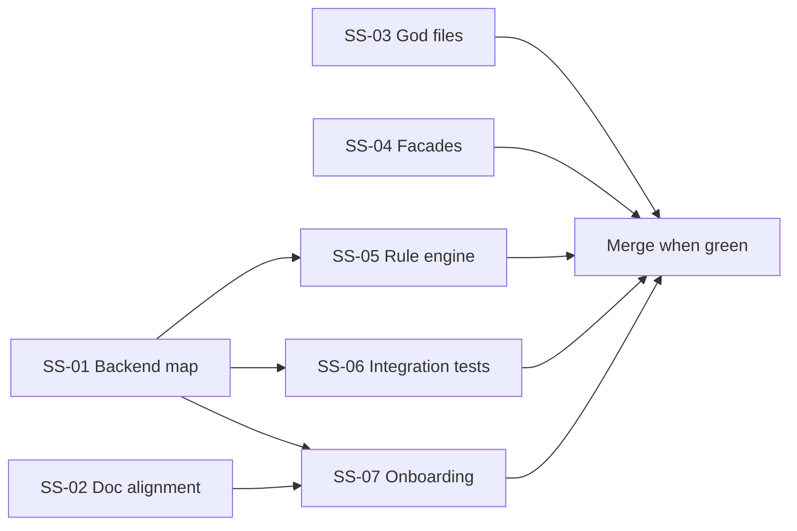

# Plan 98 — Architecture Consolidation & Code Quality Improvements

**Created:** 2026-08-13  
**Status:** Completed  
**Source:** Architecture review session (see [`../architecture-and-code-observations.md`](../architecture-and-code-observations.md))  
**Priority:** High — reduces drift, onboarding cost, and regression risk  
**Parallelism:** Subtasks SS-01..SS-07 can run in parallel where noted; SS-05 blocks on SS-01

---

## Goals

1. Make the **two-backend story** explicit and eliminate duplicate rule-engine drift
2. Align **specs and READMEs** with what actually runs today
3. **Decompose god-files** that violate coding guidelines
4. **Close or freeze** the v2 facade migration so new slices pick one data path
5. Add an **integration test spine** for UI → BE → envelope flows
6. Refresh **onboarding docs** so humans and agents don't read stale target state as current

---

## Non-Goals

- Rewriting the entire spec tree
- Choosing Tauri vs Electron vs CEF (resolve `AI-01` separately — SS-02 only documents current Chromium shell)
- Force-pushing or rebasing published git history (Lovable constraint)

---

## Subtask Index

| SS                                                                                              | Title                             | Parallel?   | Est. effort |
| ----------------------------------------------------------------------------------------------- | --------------------------------- | ----------- | ----------- |
| [SS-01](../subtasks/98-architecture-consolidation/SS-01-dual-backend-map.md)                    | Dual-backend ownership map        | ✅ Done     | 1 session   |
| [SS-02](../subtasks/98-architecture-consolidation/SS-02-spec-implementation-alignment.md)       | Spec & README alignment           | Yes         | 2 sessions  |
| [SS-03](../subtasks/98-architecture-consolidation/SS-03-god-file-decomposition.md)              | God-file decomposition            | Yes         | 3 sessions  |
| [SS-04](../subtasks/98-architecture-consolidation/SS-04-facade-migration-closeout.md)           | Facade migration closeout         | Yes         | 2 sessions  |
| [SS-05](../subtasks/98-architecture-consolidation/SS-05-rule-engine-deduplication.md)           | Rule engine deduplication         | After SS-01 | 4+ sessions |
| [SS-06](../subtasks/98-architecture-consolidation-improvements/SS-06-integration-test-spine.md) | Integration test spine            | ✅ Done     | 2 sessions  |
| [SS-07](../subtasks/98-architecture-consolidation/SS-07-onboarding-refresh.md)                  | Onboarding & what-to-read refresh | ✅ Done     | 1 session   |

---

## Execution Order (Recommended)



**Wave 1 (parallel):** SS-01, SS-02, SS-03, SS-04  
**Wave 2:** SS-05, SS-06  
**Wave 3:** SS-07  
**Closeout:** Update this file status → completed; write `.lovable/memory/v2/plan98/00-closeout.md`

---

## Acceptance Criteria (Plan-level)

- [x] `docs/architecture/runtime-map.md` exists and is linked from `README.md` (SS-01)
- [x] `BE/README.md` reflects current router/middleware/repo state — no "skeleton only" claims (SS-02)
- [x] **SS-03:** God-File Decomposition (`src/routes/__root.tsx` and `src/components/projects/ProjectEditorSections.tsx` → `src/lib/boot/*` and `src/components/projects/sections/*`) (SS-03)
- [x] Facade migration policy doc: which slices are facade-only vs store-allowed (SS-04)
- [x] Single canonical rule-eval owner documented; shared kernel or import boundary enforced (SS-05)
- [x] At least one Playwright + pytest integration test: health → rules list → envelope shape (SS-06)
- [x] `.lovable/what-to-read.md` links architecture observations + runtime map (SS-07)

---

## Verification Commands

```bash
# Frontend
bun run guidelines:check

# Backend
pytest BE/ -q
ruff check BE

# Integration (after SS-06)
bun run visual:test
pytest tests/contract/ -q
```

---

## Risks

| Risk                                  | Mitigation                                                       |
| ------------------------------------- | ---------------------------------------------------------------- |
| SS-05 touches hot paths               | Feature-flag shared kernel; parity tests before cutover          |
| SS-03 root route refactor breaks boot | Extract incrementally; keep behavior tests on seed orchestration |
| Doc updates drift again               | SS-07 adds "last verified" date to runtime map; CI link check    |

---

## Related Plans

- Plan 88 — BE v1 implementation (completed; envelope evolved since)
- Plan 86 — UI v4 seed facade completion
- Plan 41 — Error-code rollout phases 2+
- `.lovable/pending-facades/` — remaining SDK/domain facades
