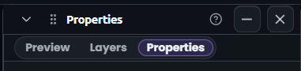

# 08: Properties panel header collapsed to a single row

## Context

User asked: "share visual suggestions" for improving the Properties floating panel header. Selected the "Underlined tabs" prototype direction from three rendered options.

## Evidence

-  - current two-band header inside Properties: band 1 has window title ("Properties"), pin button, close button; band 2 has rule selector dropdown, category chip, and "+ New Rule" button. (v3.965.0)

## Resolution (v3.965.0)

- Merged the tabs into the titlebar via a portal mount `[data-inspector-tabs-mount]` in `PanelChrome.tsx` for `panelId === "rules"`.
- Replaced segmented pills with `.inspector-tab-underline` styles: 11px Ubuntu, full-height, 2px purple bottom border on active with soft glow.
- Kept legacy `.inspector-tab-pill` classes intact for other consumers.
- Files: `src/components/app-shell/panels/PanelChrome.tsx`, `src/components/editor/InspectorSurface.tsx`, `src/styles.css`.

Fixed.
