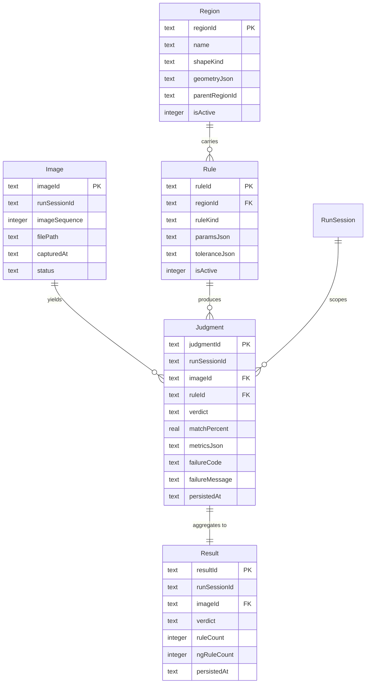

# 19 — Task DB Schema

**Status:** Locked (Plan 04 Step 19). Governs `backend/db/tasks/<TaskId>/task.db`.

Conventions inherited from `02-db-conventions-digest.md` (PascalCase tables, camelCase columns, affirmative booleans, ULID PKs, ISO-8601 UTC TEXT timestamps).

## 1. Purpose

Task DB is the **operational store** for one Task: captured images, defined regions, resolved rules at snapshot time, and every Judgment/Result. Referenced from `root.db` via string `taskId` (no cross-DB FK enforcement — see 21 §8).

Single writer: **Dispatcher**. Readers: UI, exporters, testing tools.

## 2. ER Diagram

## 3. Tables

### 3.1 `Image`

| Column          | Type             | Notes                                                         |
| --------------- | ---------------- | ------------------------------------------------------------- |
| `imageId`       | TEXT PK          | ULID                                                          |
| `runSessionId`  | TEXT NOT NULL    | String ref → `root.db:RunSession.runSessionId`                |
| `imageSequence` | INTEGER NOT NULL | 9-digit monotonic per RunSession (see 14)                     |
| `filePath`      | TEXT NOT NULL    | Relative to `TaskId/images/` — e.g. `processed/000000042.jpg` |
| `capturedAt`    | TEXT NOT NULL    | Capture wall-clock                                            |
| `status`        | TEXT NOT NULL    | Enum: `Pending` \| `Inflight` \| `Processed` \| `Failed`      |

Indexes: `UNIQUE(runSessionId, imageSequence)`, `INDEX(runSessionId, capturedAt)`.

### 3.2 `Region`

| Column           | Type                       | Notes                                                                       |
| ---------------- | -------------------------- | --------------------------------------------------------------------------- |
| `regionId`       | TEXT PK                    | ULID                                                                        |
| `name`           | TEXT NOT NULL              | Author-facing label                                                         |
| `shapeKind`      | TEXT NOT NULL              | Enum: `Rectangle` \| `Ellipse` \| `Polygon` (v1; freeform deferred - AI-04) |
| `geometryJson`   | TEXT NOT NULL              | Image-space integer px (see 32-shape-model)                                 |
| `parentRegionId` | TEXT NULL                  | Self-ref for grouped/XY-linked regions                                      |
| `isActive`       | INTEGER NOT NULL DEFAULT 1 |                                                                             |

Index: `INDEX(parentRegionId) WHERE parentRegionId IS NOT NULL`.

### 3.3 `Rule`

| Column          | Type                           | Notes                                                                                                                                                   |
| --------------- | ------------------------------ | ------------------------------------------------------------------------------------------------------------------------------------------------------- |
| `ruleId`        | TEXT PK                        | ULID                                                                                                                                                    |
| `regionId`      | TEXT NOT NULL                  | FK → `Region.regionId`                                                                                                                                  |
| `ruleKind`      | TEXT NOT NULL                  | Enum: `PresenceAbsence` \| `FlawDetect` \| `Count` \| `OcrText` \| `GraphicDisplayCheck` \| `MathExpression`                                            |
| `status`        | TEXT NOT NULL DEFAULT 'Active' | Enum: `Active` \| `Inactive` \| `Silent`                                                                                                                |
| `statusReason`  | TEXT NULL                      | Enum: `AuthorDisabled` \| `RegionMissing` \| `ToleranceUnresolved` \| `DisabledInV1` \| `SilentByAuthor` \| `SilentByOverride`; NULL when status=Active |
| `paramsJson`    | TEXT NOT NULL                  | Rule-kind-specific inputs                                                                                                                               |
| `toleranceJson` | TEXT NOT NULL                  | Numeric ranges + match-% threshold (see 34)                                                                                                             |
| `isActive`      | INTEGER NOT NULL DEFAULT 1     |                                                                                                                                                         |

Index: `INDEX(regionId)`.

Note: at RunSession start, the Dispatcher resolves `Rule` + `rules.db` overrides into an **immutable snapshot** (see 23 and 13); workers read the snapshot, not this table.

### 3.4 `Judgment` (one row per rule per image)

| Column           | Type          | Notes                                                      |
| ---------------- | ------------- | ---------------------------------------------------------- |
| `judgmentId`     | TEXT PK       | ULID                                                       |
| `runSessionId`   | TEXT NOT NULL | String ref                                                 |
| `imageId`        | TEXT NOT NULL | FK → `Image.imageId`                                       |
| `ruleId`         | TEXT NOT NULL | FK → `Rule.ruleId` (snapshot copy id)                      |
| `verdict`        | TEXT NOT NULL | Enum: `Pass` \| `Fail` \| `Error`                          |
| `matchPercent`   | REAL NULL     | 0.0–100.0; NULL if rule kind has no match%                 |
| `metricsJson`    | TEXT NOT NULL | Rule-kind-specific outputs (count, bbox, OCR string, etc.) |
| `failureCode`    | TEXT NULL     | Set when `verdict='ERROR'` (see 15 §4)                     |
| `failureMessage` | TEXT NULL     | Human message                                              |
| `persistedAt`    | TEXT NOT NULL | Wall-clock at DB write                                     |

Indexes: `INDEX(runSessionId, imageId)`, `INDEX(runSessionId, verdict)`.

### 3.5 `Result` (one row per image; aggregate of its Judgments)

| Column          | Type                 | Notes                                                                                                                                                       |
| --------------- | -------------------- | ----------------------------------------------------------------------------------------------------------------------------------------------------------- |
| `resultId`      | TEXT PK              | ULID                                                                                                                                                        |
| `runSessionId`  | TEXT NOT NULL        | String ref                                                                                                                                                  |
| `imageId`       | TEXT NOT NULL UNIQUE | FK → `Image.imageId`                                                                                                                                        |
| `verdict`       | TEXT NOT NULL        | `Pass` iff every counted Judgment is `Pass`; `Fail` if any `Fail`; `Error` if any `Error` and no `Fail`. Silent Judgments are excluded from this aggregate. |
| `ruleCount`     | INTEGER NOT NULL     | Total rules in bundle (Active + Inactive + Silent)                                                                                                          |
| `activeCount`   | INTEGER NOT NULL     |                                                                                                                                                             |
| `silentCount`   | INTEGER NOT NULL     |                                                                                                                                                             |
| `failRuleCount` | INTEGER NOT NULL     | Only Active `Fail` rules                                                                                                                                    |
| `persistedAt`   | TEXT NOT NULL        |                                                                                                                                                             |

Verdict precedence (locked): `Fail` > `Error` > `Pass`. Same-image `Fail` masks `Error`.

Index: `UNIQUE(imageId)`, `INDEX(runSessionId, verdict)`.

### 3.6 `SchemaVersion`

Same shape as `root.db:SchemaVersion`. Owned by 26-migrations.

## 4. Enums (CHECK-enforced, PascalCase)

- `Image.status`: `Pending`, `Inflight`, `Processed`, `Failed`.
- `Region.shapeKind`: `Rectangle`, `Ellipse`, `Polygon`.
- `Rule.ruleKind`: `PresenceAbsence`, `FlawDetect`, `Count`, `OcrText`, `GraphicDisplayCheck`, `MathExpression`.
- `Rule.status` (author-set): `Active`, `Inactive` (author disabled), `Silent` (evaluated but not counted toward verdict).
- `Judgment.verdict`, `Result.verdict`: `Pass`, `Fail`, `Error`. Precedence: `Fail` > `Error` > `Pass`.
- No `SCREAMING_SNAKE_CASE` enum values anywhere. Legacy values (`OK`, `NG`, `PRESENCE`, `PENDING`, …) are `E_BUG_ENUM_LEGACY` at write time.

## 5. Write Rules

- Dispatcher is the **only** writer. WAL mode; `synchronous=NORMAL`; `busy_timeout=5000`.
- Judgments are written **independently** — no batch commit (per 13).
- `Result` is derived from `Judgment` and written **once per image** after all its Judgments land. If a worker crash prevents completion, `Result` is written by the Dispatcher's reclaim step with the partial verdict + `ERROR`.
- No triggers. Derivations in Python.
- Cross-DB FK to `root.db:RunSession` is by string only. Orphan detection is a maintenance job (owner: 46-open-questions).

## 6. Read Rules

- UI: read-only WAL-reader. Queries by `runSessionId` first, then `imageId`.
- Sort by chronology: use `Image.imageSequence` (never `persistedAt`) per 16 §5.

## 7. Non-Goals

- No image bytes in DB. Bytes live under `images/` (see 20).
- No AI-validation columns in v1 (stub — see 43).
- No archival/partitioning in v1; per-Task DB size cap is a maintenance concern (46).

## Acceptance Checklist

- [ ] Task DB is per-task-folder, no cross-task queries (`E_DB_SPLIT_VIOLATION`).
- [ ] Result rows carry `metrics.tolerance` inline per memory 09.
- [ ] Deletion follows folder-owner semantics from spec 06.
