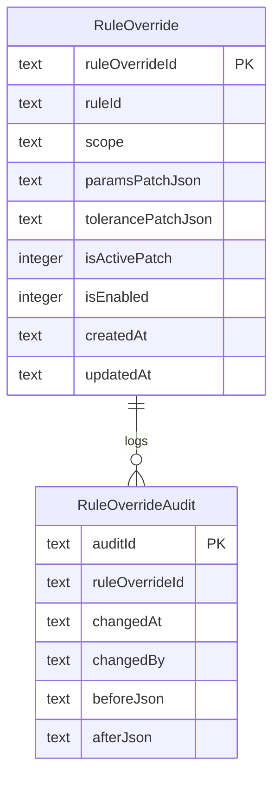

# 20 — Rules DB Overrides

**Status:** Locked (Plan 04 Step 20). Governs `backend/db/tasks/<TaskId>/rules.db`.

Anchors: `03-split-db-digest.md` (layered override architecture), `13-worker-pattern.md` (snapshot contract), `22-task-db.md` §3.3 (base `Rule`).

## 1. Purpose

`rules.db` holds **overrides** for the Task's base rules — not the base rules themselves. Base rules live in `task.db:Rule` (see 22). Overrides let an operator tune `paramsJson` and `toleranceJson` per-shift / per-lot without rewriting the recipe.

At RunSession start, Dispatcher **resolves** base + overrides into a single immutable JSON snapshot (`snapshots/<RunSessionId>.json`) that workers read for the entire run.

Single writer: **Rule Author flow** (offline, via UI Rule Setup — 31). Readers: Dispatcher (at RunSession start only).

## 2. Layer Order (LOCKED)

Highest wins:

```
1. Runtime override      (rules.db:RuleOverride  scope='RUNTIME')
2. Task override         (rules.db:RuleOverride  scope='TASK')
3. Base rule             (task.db:Rule)
```

`Job`-level overrides are **out of scope for v1** (resolves AI-08 to "Task-only cascade"). Adding a Job layer later is additive: insert between (2) and (3).

Per-field merge (not row replace):

- Each overridable field (`paramsJson`, `toleranceJson`, `isActive`) is merged **at the top-level key**.
- Nested keys are deep-merged; arrays are **replaced** (not concatenated).
- A `null` override value means "unset this key" — falls through to lower layer.

## 3. ER Diagram



## 4. Tables

### 4.1 `RuleOverride`

| Column               | Type                       | Notes                                               |
| -------------------- | -------------------------- | --------------------------------------------------- |
| `ruleOverrideId`     | TEXT PK                    | ULID                                                |
| `ruleId`             | TEXT NOT NULL              | String ref → `task.db:Rule.ruleId`                  |
| `scope`              | TEXT NOT NULL              | Enum: `TASK` \| `RUNTIME`                           |
| `paramsPatchJson`    | TEXT NULL                  | Partial JSON patch for `paramsJson`                 |
| `tolerancePatchJson` | TEXT NULL                  | Partial JSON patch for `toleranceJson`              |
| `isActivePatch`      | INTEGER NULL               | 0/1/NULL; NULL = inherit                            |
| `isEnabled`          | INTEGER NOT NULL DEFAULT 1 | Author can disable the override without deleting it |
| `createdAt`          | TEXT NOT NULL              |                                                     |
| `updatedAt`          | TEXT NOT NULL              |                                                     |

Indexes: `UNIQUE(ruleId, scope) WHERE isEnabled = 1`, `INDEX(ruleId)`.

Uniqueness rationale: at most one active override per `(ruleId, scope)` avoids ambiguous merges.

### 4.2 `RuleOverrideAudit`

| Column           | Type          | Notes                                                    |
| ---------------- | ------------- | -------------------------------------------------------- |
| `auditId`        | TEXT PK       | ULID                                                     |
| `ruleOverrideId` | TEXT NOT NULL | FK → `RuleOverride.ruleOverrideId`                       |
| `changedAt`      | TEXT NOT NULL |                                                          |
| `changedBy`      | TEXT NOT NULL | Operator id/string (single-operator install for v1 — 44) |
| `beforeJson`     | TEXT NULL     | Full row JSON before change                              |
| `afterJson`      | TEXT NULL     | Full row JSON after change                               |

Index: `INDEX(ruleOverrideId, changedAt DESC)`.

### 4.3 `SchemaVersion`

Same shape as 21 §3.6.

## 5. Enums (CHECK-enforced)

- `RuleOverride.scope`: `TASK`, `RUNTIME`.

## 6. Resolution Algorithm (Dispatcher, at RunSession start)

```
for each Rule r in task.db where r.isActive = 1:
    effective = { params: r.paramsJson, tolerance: r.toleranceJson, isActive: 1 }
    for scope in ['TASK', 'RUNTIME']:               # low → high
        o = rules.db.select where ruleId=r.ruleId and scope=scope and isEnabled=1
        if o:
            effective.params    = deepMerge(effective.params,    o.paramsPatchJson,    dropNulls=True)
            effective.tolerance = deepMerge(effective.tolerance, o.tolerancePatchJson, dropNulls=True)
            if o.isActivePatch is not NULL:
                effective.isActive = o.isActivePatch
    if effective.isActive == 1:
        emit(r.ruleId, effective)

write snapshots/<RunSessionId>.json
```

Snapshot is **immutable for the RunSession**. Editing `rules.db` mid-run does NOT affect the running workers. New values take effect at the next RunSession.

## 7. Write Rules

- Only the Rule Author flow (UI Rule Setup) writes. WAL mode; single-writer.
- Every write to `RuleOverride` MUST also insert a `RuleOverrideAudit` row (enforced by the write helper in `core/io`, per 12).
- No writes during a RunSession by policy (not by lock). The UI disables override editing while `RunSession.status='RUNNING'` for the same Task.

## 8. Read Rules

- Dispatcher reads once at RunSession start and closes the connection.
- Workers **never** open `rules.db`; they read the snapshot file.

## 9. Override Cap (LOCKED — resolves Q-03)

- **Hard cap:** `1_000` active `RuleOverride` rows per Task (rows with `isEnabled=1`). Disabled rows and audit rows do not count.
- **Soft warn threshold:** `800`. The Rule Setup UI surfaces a non-blocking banner and the writer emits `W_RULE_OVERRIDE_SOFT_LIMIT` to `logs/task.log` at each write past the threshold.
- **Over-cap behavior:** the write helper in `core/io` rejects the insert/enable with `E_RULE_OVERRIDE_LIMIT` (per 40); the UI shows the error inline and blocks save. Operators must disable or delete rows to make room.
- **Enforcement point:** single-writer helper, in the same transaction as the `RuleOverrideAudit` insert. Read paths (Dispatcher snapshot) are never gated by the cap.
- **Rationale:** the resolved snapshot loaded by every worker at RunSession start stays bounded and predictable; unbounded overrides would defeat the "immutable snapshot" contract in §1.

## 10. Non-Goals

- No `Job`-level overrides in v1.
- No cross-Task rule sharing; each Task has its own `rules.db`.
- No time-windowed overrides (e.g., "apply only 09:00–17:00") in v1 — logged in 46.
- No merge conflict resolution beyond "highest scope wins per key"; the audit table is the only rollback path.
- No auto-pruning of disabled overrides to stay under cap — explicit operator action only.

## Acceptance Checklist

- [ ] Override precedence order (bundle < task < session) matches spec 33.
- [ ] Every override key is declared in spec 27 config surface.
- [ ] Overrides are audited via `AuditPersistenceFacade` per spec 72.
