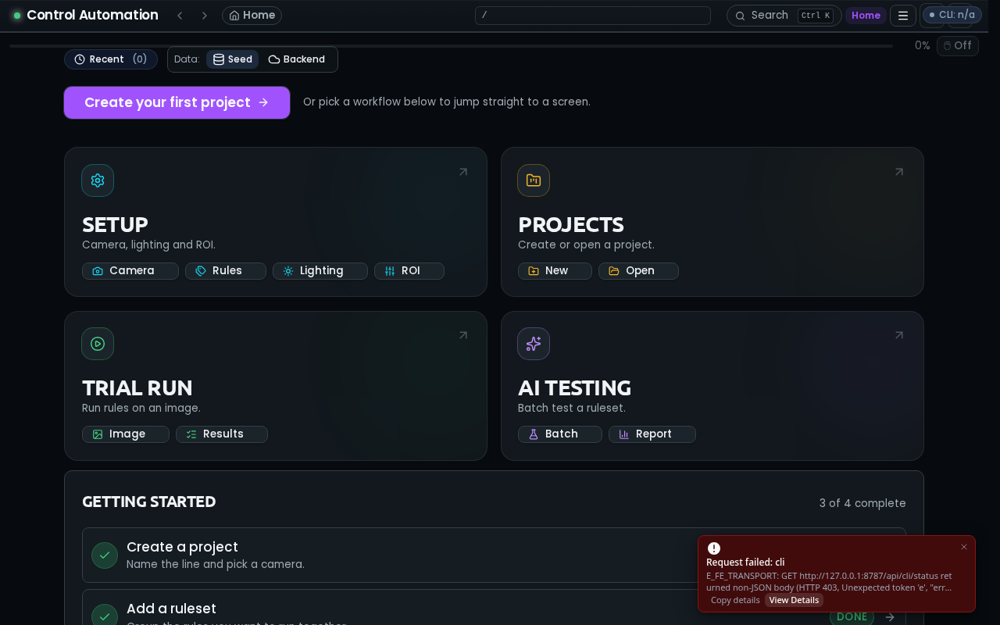

# Control Automation

> Inspection HMI for factory-floor operators. Set up rules, run captures, watch results, and keep the line moving.

**Live preview:** https://cat-my-ui-v11.lovable.app



---

## What this is

Control Automation is a desktop-style HMI (Human-Machine Interface) for camera-based inspection work. Operators define regions of interest, attach validation rules, and run those rules against live or seeded camera frames. The app is built to feel calm on a shop-floor screen: dense where it needs to be, quiet everywhere else.

The frontend is a TanStack Start + Vite React app. The backend is a Python stack (FastAPI HTTP surface, capture / dispatcher / worker processes, a vendor-neutral SDK facade). Frontend and backend usually run on the same machine, wrapped in a Chromium shell.

Two data modes ship in the box:

- **Seed mode** - the UI runs against local JSON fixtures. No backend needed. Great for design work and demos.
- **Backend mode** - the UI talks to a real Python backend at a configurable base URL (default `http://localhost:8787`).

You switch modes from the homepage or from Settings. The chosen backend URL is remembered.

## Quick links

|                  |                                                        |
| ---------------- | ------------------------------------------------------ |
| Live app         | https://cat-my-ui-v11.lovable.app                      |
| Spec root        | [`spec/00-overview.md`](spec/00-overview.md)           |
| Onboarding trail | [`.lovable/what-to-read.md`](.lovable/what-to-read.md) |
| Agent playbook   | [`AGENTS.md`](AGENTS.md)                               |
| Changelog        | [`CHANGELOG.md`](CHANGELOG.md)                         |
| Release notes    | [`RELEASE_NOTES.md`](RELEASE_NOTES.md)                 |
| Plan index       | [`.lovable/plans/index.md`](.lovable/plans/index.md)   |
| Project memory   | [`mem/index.md`](mem/index.md)                         |

## Local dev (BE+FE+Shell)

On Windows (or anywhere with PowerShell 7), one file does everything:

```powershell
.\run.ps1                  # Start backend (8787), frontend (5173), and chromium shell
.\run.ps1 -NoShell         # Skip launching Chromium
.\run.ps1 -Help            # every mode and flag, explained
```

On POSIX systems (Linux/macOS), use the shell script:

```bash
./run.sh                   # Start backend, frontend, and chromium shell
./run.sh --no-shell        # Skip launching Chromium
./run.sh --help            # every mode and flag, explained
```

`run.ps1` and `run.sh` are standalone and automatically bundle the backend (`BE/`) and frontend together.

Prefer to drive it by hand?

```bash
# Frontend (http://localhost:5173)
bun install
bun run dev --port 5173

# Backend (http://localhost:8787)
cd BE
pip install -e .
uv run --project BE uvicorn BE.main:app --port 8787
```

Once both are up, open the app and use the **Seed / Backend** toggle on the homepage (or in Settings) to point the UI at your local backend. The backend base URL is editable and persisted in `localStorage` under `app.backend.baseUrl`.

## Project structure

| Path                                     | What lives here                                                     |
| ---------------------------------------- | ------------------------------------------------------------------- |
| `src/`                                   | Frontend: TanStack Start routes, editor, panels, hooks, stores      |
| `BE/`                                    | Python backend: FastAPI app, SDK facade, response envelope, CLI     |
| `worker/`, `services/validation-worker/` | Validation worker (Python HTTP scorer)                              |
| `sdk/`                                   | Vendor SDK drops (never edited in place; wrapped by the facade)     |
| `app/`                                   | Capture, dispatcher, worker runtime (device I/O, rules, supervisor) |
| `spec/`                                  | Full specification tree (see `spec/00-overview.md`)                 |
| `docs/`                                  | Diagrams, runbooks, verification notes                              |
| `scripts/`, `packaging/`, `linters/`     | Build, install, and lint tooling                                    |
| `tests/`                                 | Contract, integration, unit, and visual tests                       |
| `.lovable/`                              | Plans, memory, prompts, completed-work archive                      |
| `.githooks/`, `.github/`                 | Pre-commit hooks and CI workflows                                   |

## How planning and memory are organised

This repo tracks work in the open. If you want to know why something looks the way it does, these are the places to look:

- **`mem/index.md`** - project-wide rules and design decisions the AI agent and humans both honour.
- **`.lovable/plan.md`** - the active serial execution plan (what "next" means today).
- **`.lovable/plans/`** - audits, planning docs, and per-plan working notes.
- **`.lovable/memory/`** - closeout memos written when a plan finishes.
- **`.lovable/pending-facades/`** - facade backlog (SDK wrappers, camera/rules/samples adapters).
- **`.lovable/what-to-read.md`** - suggested reading trail for a fresh contributor.

## Recently shipped

A short, human-readable slice of the last few weeks. See `CHANGELOG.md` for the full version history.

- **Observability sessions** got saved views, shareable filter URLs, and server-side sorting.
- **Ruleset draft-save** now round-trips through IndexedDB with a conflict-resolution modal and a boot-time reconcile pass that surfaces drift on page load.
- **Installer** learned to fingerprint its own binaries: `install.json` schema v2, SHA256 cross-checks, an upgrade-in-place planner, and a `verify-install` CI job.
- **PowerShell wrappers** were de-duplicated behind a shared `Common.psm1` module and gated by PSScriptAnalyzer in CI.
- **Live tail viewer** wires `/observability/runs/{runId}` to a session log stream with auto-reconnect and backoff.
- **Error toasts** were compacted, made dismissible with a right-side close, deduped so the same error never storms the screen, and clicking one opens the full detail modal.
- **Right-rail panels** (Properties + Layers) were rebuilt to keep Bounds inputs visible at narrow widths, use container queries, and stop overlapping at compact sizes.
- **Seed / Backend data-source toggle** was added to the homepage and Settings, with a health probe and editable backend URL.
- **Root shell** picked up a nav + sidebar port, semantic theme tokens, and a HmiShell wrapper across admin routes.
- **Rule editor** gained a persistent rotation badge, trimmed selection pips, and a 24px hit-target overlay pass.

## What's pending

Work is grouped so it can be tackled in parallel where possible. The full list lives in [`.lovable/plans/index.md`](.lovable/plans/index.md).

| Group | Focus              | Highlights                                                                                                                                         |
| ----- | ------------------ | -------------------------------------------------------------------------------------------------------------------------------------------------- |
| A     | UI shell polish    | Per-section collapse on the right rail, hover/selection colour parity, density audit follow-ups                                                    |
| B     | Rule editor        | Remaining Plan 79 steps (37-38), Plan 59 slice work                                                                                                |
| C     | Security           | Scan-finding closeouts and memory refresh                                                                                                          |
| D     | Docs viewer        | Copy-markdown, fullscreen mode, sidebar polish                                                                                                     |
| E     | Backend / CLI      | Plan 90 tail steps (observability, installer, retention)                                                                                           |
| F     | Error-code rollout | Plan 41 phases 2+ (typed AppError propagation across FE and BE)                                                                                    |
| G     | Facade backlog     | Items under `.lovable/pending-facades/` (rule, category alias, mic, camera, project v4, swatches, samples, canvas prefs, type tool, palette state) |

## Contributing

- Read [`AGENTS.md`](AGENTS.md) and [`spec/02-coding-guidelines/`](spec/02-coding-guidelines/) before your first change.
- Every non-trivial task lands with a plan in `.lovable/plans/` and a closeout memo in `.lovable/memory/`.
- Errors follow the Universal Response Envelope defined in [`spec/03-error-manage/`](spec/03-error-manage/). No swallowed catches.
- Prefer facades over direct SDK calls. Raw vendor SDKs are wrapped before they reach app code.
- Run `bunx tsgo --noEmit` for the frontend and `pytest BE/ -q` for the backend before opening a PR.

## Credits

Built by the Control Automation team. UI iterated with the Lovable agent; specs, planning notes, and memory live in-repo so the next contributor (human or AI) has a fair chance.

---

<sub>Looking for the old version-pin history? It moved to <a href="CHANGELOG.md"><code>CHANGELOG.md</code></a>.</sub>
