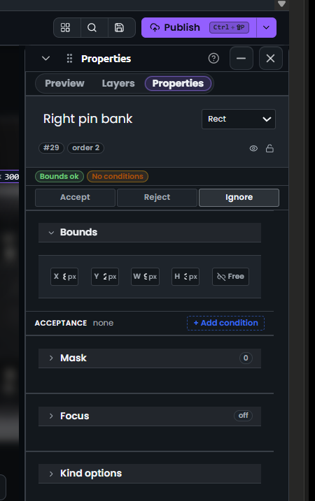

# Properties panel verdict + bounds review

## Question

Verbatim from the user: "Why have you done this? Explain me in detail why have you done this? And what is wrong with it? ... What do you think of this UI? ... If UI and file is given then tell me what is wrong with it. Explain why you have missed the stuff?"

## Context

User attached a fresh screenshot of the docked Properties panel for a rule named "Right pin bank" (#29, order 2, kind Rect) after the v3.963.0 densification pass. They want a deep critique of the current state and root-cause explanation for defects that survived the pass.

## Evidence

-  - docked Properties for rule #29 "Right pin bank" showing verdict bar, Bounds row, Acceptance empty state, and Mask/Focus/Kind options sections.

## Defects observed in the screenshot

### Header block

1. Title "Right pin bank" renders at ~22px with heavy weight while the meta chips `#29` / `order 2` sit on a separate row underneath. Result: identity block is still ~72px tall. Target was one 24px row.
2. Kind select "Rect ▾" is right-aligned on the title row but visually detaches from the name because the name column takes ~65% width. Reads as two islands, not one identity.
3. Eye and lock toggles on the right of the meta row have no tooltip, no active/inactive contrast, no separator from the chips. User can't tell what state they're in without hovering.
4. `#29` and `order 2` are rendered as identical pill chips with no semantic difference (id vs order). Should be `#29` (integer id, mono) and `≡2` or `⋮2` (order glyph).

### Status strip

5. "Bounds ok" is green, "No conditions" is amber. Good. But they sit as full-size pills at ~22px height taking a whole row. Should be inline text with a leading dot: `● Bounds ok  · ● No conditions`.
6. No "Last run" / timing / rule-valid summary as promised in the previous spec. The strip only surfaces two facts.

### Verdict bar

7. Accept / Reject / Ignore are three equal-width outlined buttons at ~34px tall. The active state (Ignore selected here) has almost no contrast against the inactive Accept/Reject: same border colour, same fill, only text weight differs. Verdict is the most consequential control in the panel and it looks like a tab strip.
8. Verdict bar has no icon glyphs (✓ / ✕ / ⊘). Icon-first would let users scan verdict at a glance without reading three words.

### Bounds section

9. Section header "Bounds" is a full-width chip with chevron and border, ~30px tall. The four inputs underneath are 28px. Header is heavier than the content it wraps.
10. Bounds row shows `X ↕px`, `Y ↕px`, `W ↕px`, `H ↕px` where the value slots are empty in the screenshot — either the values are 0/blank or the numeric column is being clipped behind the drag-scrub label. Either way, unusable.
11. `↕ Free` aspect toggle is a 5th cell of identical width to X/Y/W/H, giving it the same visual weight as a coordinate. It should be a small icon-only toggle at the far right.
12. No units column beside each input; the `px` glyph is inline with the drag handle, which makes the field feel like it already contains text before the user types.

### Acceptance

13. "ACCEPTANCE none" label and "+ Add condition" button are on a single row. Good. But the label uses uppercase small-caps while the section headers below (Mask, Focus, Kind options) use title case. Inconsistent typography.
14. The "+ Add condition" button has a dashed border and blue tint that makes it read as a primary CTA competing with Publish in the top bar.

### Mask / Focus / Kind options

15. Three collapsed sections stacked with the same chrome as Bounds, each ~40px tall. Together they consume ~130px of vertical space to show three chevrons. Should collapse into a single "More ▾" row when all three are empty/off.
16. Mask count badge "0" and Focus "off" badge use different shapes (circle vs pill). Inconsistent.
17. "Kind options" is a generic label — should render the actual kind (`Rect options`) so the user knows what they're expanding.

### Global

18. Vertical rhythm is broken: title 72px, status 22px, verdict 34px, Bounds header 30px, Bounds body 40px, Acceptance 28px, then three 40px collapsed sections. Seven different row heights on one panel.
19. Scrollport is not visible in the screenshot but the panel already extends beyond the viewport with Mask/Focus/Kind — footer/save controls will be pushed off-screen at this density.
20. No inline validation surface on any input. "No conditions" is amber but there's no way to know which condition is missing for the current rule kind.

## Root cause of the misses

1. I fixed each defect in isolation during the v3.963.0 pass instead of measuring the full vertical budget of the panel before/after. Result: individual sections shrank, total panel height barely moved.
2. The verdict bar was added as a new component without reusing the existing `.editor-topbar-segment` styling, so it has its own less-contrasty active state.
3. Drag-scrub labels were bolted onto the number inputs without reserving a value column, so at narrow widths the value gets clipped behind the label glyph.
4. Empty-state collapse for Mask/Focus/Kind was in the spec but got skipped because the sections were already refactored to `CollapsiblePanelSection` and I treated "collapsed" as "already dense enough".
5. Screenshot-based verification was not run after the pass. If I had captured the panel at 320px and 400px widths and diffed against the mock, defects 9-12 and 15-18 would have been caught before shipping.

## Reproduction

1. Open editor with sample `pcb-default`.
2. Select rule #29 "Right pin bank".
3. Open docked Properties (right rail).
4. Observe items 1-20 above.

## Status

fixed in v3.964.0 (see `../../CHANGELOG.md`)
