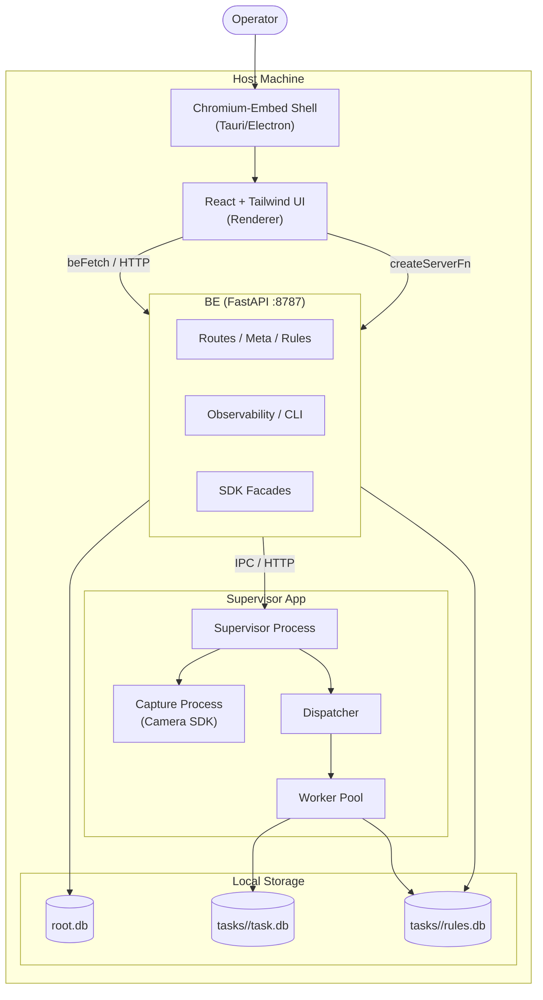

# Runtime Process & Backend Ownership Map

This document outlines the current process architecture, network boundaries, and module ownership for the Vision Inspection App. It serves as the canonical map for understanding where code executes and how UI actions translate to backend processes.

## 1. Process Diagram

The system comprises several isolated processes running on the host, communicating via HTTP, IPC, and shared databases.

## 2. Endpoint Table (UI → HTTP Target)

This section maps UI concepts to their actual targets. Note: UI primarily uses `createServerFn` (TanStack) which internally delegates to `beFetch` targeting `BE/`, or accesses local seed data.

| Route / Screen | Transport / Mechanism | Canonical Target | Notes |
|----------------|-----------------------|------------------|-------|
| Settings / Health | `apiFetch` | `BE/routes/health.py` (`/api/health`) | Direct HTTP |
| Rules Editor | `createServerFn` → `beFetch` | `BE/routes/rules.py` | Full CRUD |
| Observability | `createServerFn` → `beFetch` | `BE/routes/observability/**` | CLI sessions, logs |
| Diagnostics | `createServerFn` → `beFetch` | `BE/routes/cli_doctor.py` | Health reports |
| Project / Captures | `createServerFn` → `beFetch` | `BE/routes/samples.py` | Image sampling |
| Seed/Demo | Local DB (IndexedDB / memory) | `src/lib/seed/` | No network |

## 3. Write-Path Table

Mutations (creates, updates, deletes) flow through distinct paths based on their domain:

| Mutation Domain | UI Mechanism | Intermediary | Ultimate Writer |
|-----------------|--------------|--------------|-----------------|
| Rule Updates | `useServerFn` | `beFetch` | `BE/repos/` → `RulesDb` / `RootDb` |
| Project Config | `useServerFn` | `beFetch` | `BE/repos/` → `RootDb` |
| Camera Settings | `useServerFn` | `BE Facades` | `app/capture/` (via IPC) |
| System Config | `useServerFn` | `beFetch` | `BE/routes/cli_config.py` |
| Local UI Prefs | `useStore` (Zustand) | Browser Storage | IndexedDB / LocalStorage |

## 4. Ownership Matrix

Identifies the canonical owner for specific system concerns to avoid duplicate rule-engine drift or parallel implementations.

| Concern | Canonical owner | Notes |
|---------|-----------------|-------|
| Rule CRUD (setup) | `BE/routes/rules.py` → `BE/repos/` | FE Save button |
| Rule evaluation (live run) | `rule_kernel/engine.py` | Shared by BE and worker |
| Camera list/capture | `BE/sdk_facade/camera.py` + `app/capture/` | Split today |
| Observability / CLI | `BE/routes/observability/**` | |
| Seed/demo data | `src/lib/seed/` + facades | No network |

## 5. Explicit "Do Not" List

To maintain architectural integrity and process isolation, strictly adhere to the following rules:

- **DO NOT** import `BE/sdk_facade/` directly from `BE/routes/` without explicit interfaces.
- **DO NOT** join `RootDb` and `TaskDb` in a single SQL query; they are separate databases with separate connections.
- **DO NOT** perform long-running blocking operations in the `BE/` event loop; delegate to `app/worker`.
- **DO NOT** call authed server functions from public route loaders.
- **DO NOT** swallow transport errors in `beFetch`; rely on the Universal Response Envelope (see Plan 90).
- **DO NOT** write UI state directly to files; always go through `beFetch` or designated server functions.

## 6. Integration spine

To ensure cross-layer compatibility (UI → BE → envelope shape → error codes), the project uses an integration test spine covering canonical endpoints and adapters:

- **BE Contract Tests:** `tests/contract/test_be_spine.py` (T-001, T-002) - validates the FastApi `create_app()` envelope for `/healthz`, `/meta`, and `/rules`.
- **E2E Playwright Toggle:** `tests/e2e/data_source_backend_spine.py` (T-003) - smoke test for switching the UI to the live backend.
- **UI HttpClient adapter:** `src/lib/backend/__tests__/httpClient.test.ts` (T-004) - validates the UI safely parses both success and `BackendHttpError` envelopes, including `E9005` on missing JSON.

## Gaps

- Missing explicit supervisor endpoints accessed directly by the UI. Most communication currently routes through `BE/`.
- TBD: Worker to UI real-time progress (SSE) boundary mapping.

*Last Verified: 2026-08-16*
