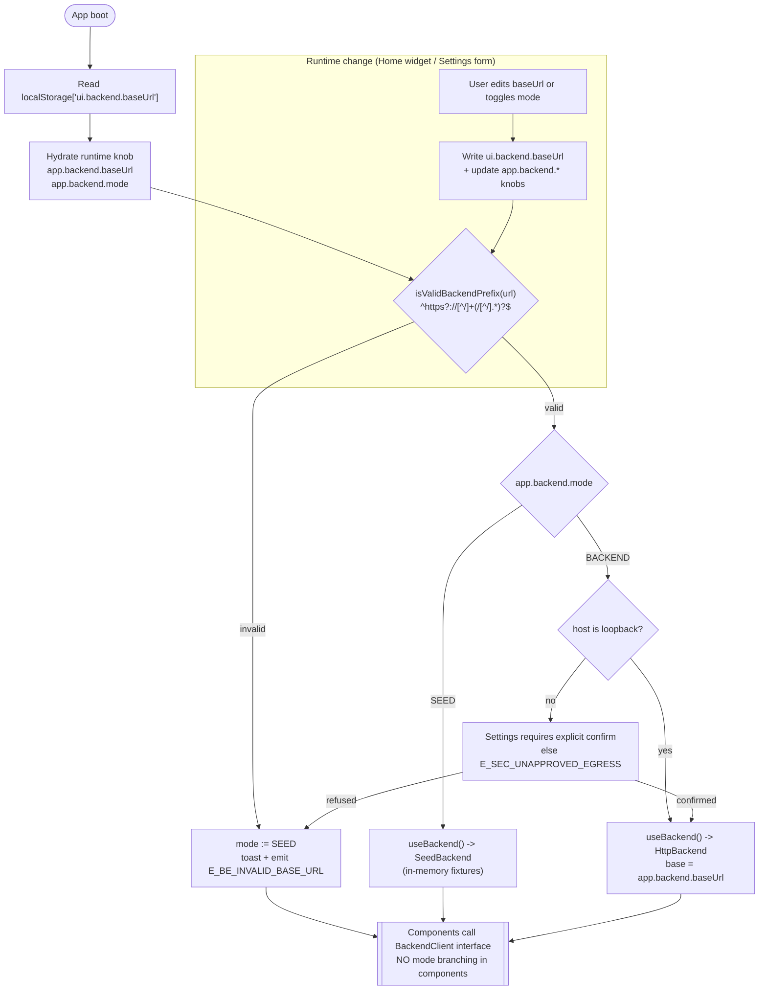

# 01 - Mode Toggle (`useBackend()`)

Shows how the FE picks Seed vs Backend at boot and on runtime changes from Home / Settings.

## Reads

- `ui.backend.baseUrl` (localStorage, UI-local allowlist per `27-config-surface.md`)
- `app.backend.mode` runtime knob (default `SEED`)
- `app.backend.baseUrl` runtime knob (default `http://localhost:8787`)

## Emits

- `E_BE_INVALID_BASE_URL` on regex fail
- `E_SEC_UNAPPROVED_EGRESS` on non-loopback without confirm
