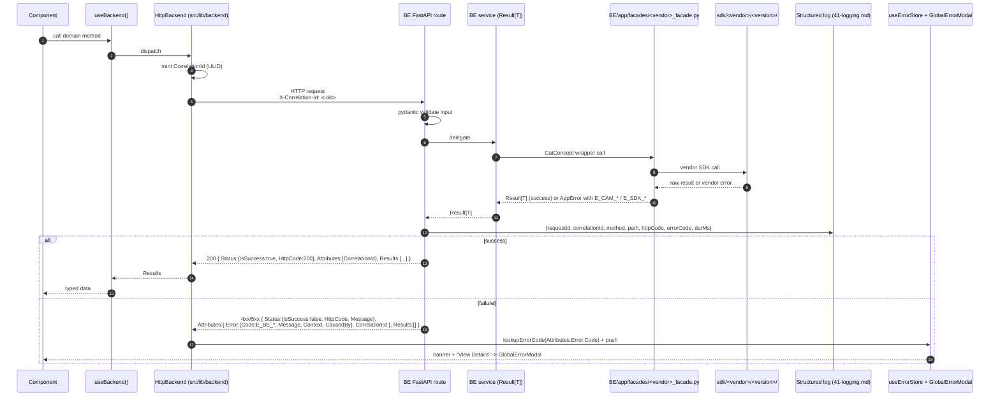

# 02 - Request Lifecycle (Envelope + Correlation-ID)

End-to-end shape for one FE call reaching a BE route, hitting a vendor SDK via the facade, and returning through the envelope.

## Invariants

- Envelope keys PascalCase always: `Status`, `Attributes`, `Results`.
- `AppError` on the wire: `{Code, Message, Context, CausedBy}`. No `Stack` on the wire; dev stack lives in server logs, 40 frames max, redacted.
- One level of `CausedBy` only.
- `X-Correlation-Id` MUST be echoed in the response headers AND logged.
