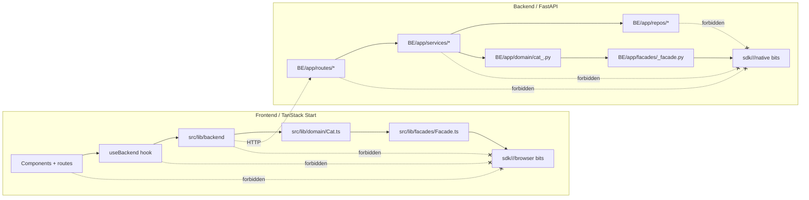

# 03 - SDK Facade Layers (import boundaries)

Only four folders may import from `sdk/**`. Anything else violates `E_BUG_SDK_LEAK` and fails the CI grep gate.

## Rule (locked `52-sdk-facade-pattern.md`)

- Raw SDK drops live at `sdk/<vendor>/<version>/` read-only with a hashed manifest.
- Backend imports `sdk/**` ONLY from `BE/app/facades/<vendor>_facade.py`. Domain callers use `BE/app/domain/cat_<concept>.py` (`Cat<Concept>`).
- Frontend imports `sdk/**` browser bits ONLY from `src/lib/facades/<Vendor>Facade.ts`. Domain callers use `src/lib/domain/Cat<Concept>.ts` (`Cat<Concept>`).
- CI grep gate: `rg -n "from ['\"]sdk/|import .* from ['\"]sdk/"` outside those four paths -> `E_BUG_SDK_LEAK`.
