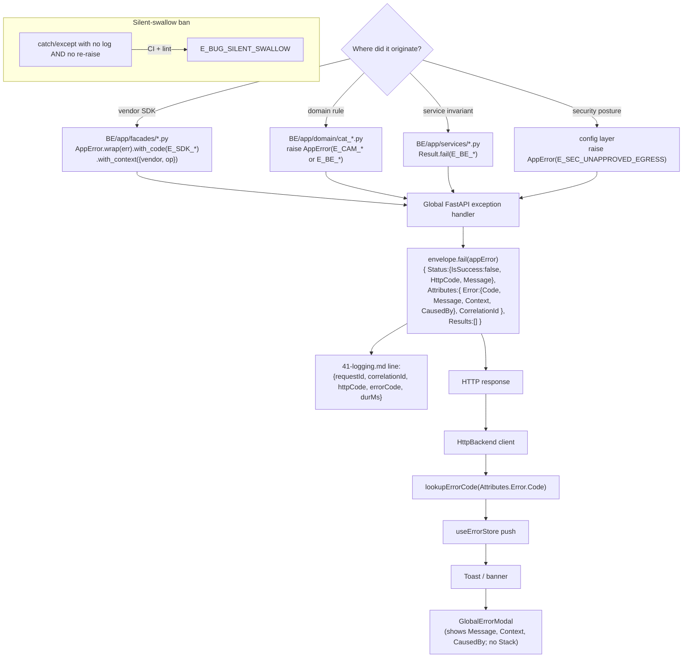

# 04 - Error Propagation

How an `AppError` originates, embeds into the envelope, and reaches the user.

## Code families reserved for Plan 88

- `E_BE_*` - backend HTTP / service invariants (e.g. `E_BE_INVALID_BASE_URL`, `E_BE_TIMEOUT`).
- `E_CAM_*` - camera facade domain errors.
- `E_SDK_*` - vendor SDK adapter errors.
- `E_SEC_*` - security posture (e.g. `E_SEC_UNAPPROVED_EGRESS`).
- `E_BUG_*` - developer-error class (silent swallow, sdk leak, etc.).

Numeric `BE-4xxx` / `CAM-10xx` ranges are RETIRED.
