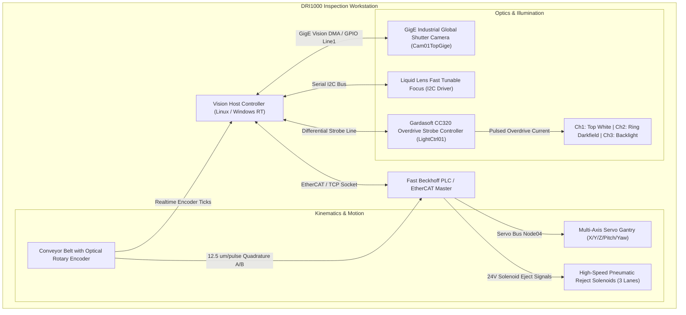
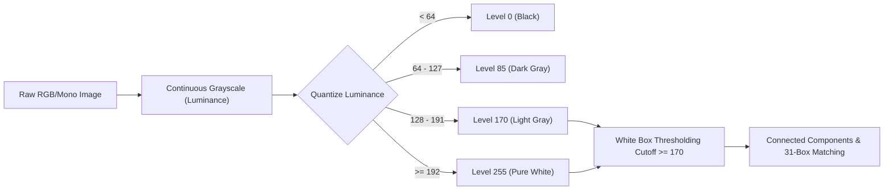
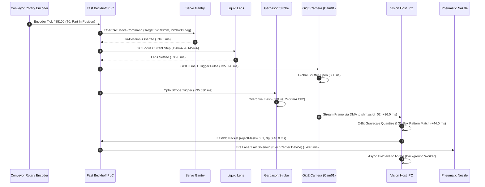

# DRI1000 Machine Control & Vision Inspection JSON Protocol

> **Specification Version:** 1.0.0  
> **Target Machine Platform:** DRI1000 Multi-Angle High-Speed Optical Inspection Workstation  
> **Directory Scope:** `docs/jsonInstructions/`  
> **Schema Contract:** Two-tier root envelope (`"attributes"` and `"data"`) across all commands and telemetry  

---

## 1. Executive Summary

This directory defines the industrial-grade, JSON-based machine communication and instruction protocol for the **DRI1000** Automated Optical Inspection (AOI) machine. The system synchronizes high-speed multi-axis servo gantries, liquid lens optical focal drivers, multi-channel overdrive strobe controllers, GigE industrial global shutter cameras, and fast PLC pneumatic reject diverters.

Every JSON file in this architecture adheres strictly to a deterministic two-tier envelope:
1. **`attributes`**: Environmental metadata, spatial kinematics, conveyor tracking, optical calibration, safety interlocks, and traceability identifiers.
2. **`data`**: Discrete execution policies, ordered action dispatch sequences, inspection results, hardware handshake protocols, and fault recovery routines.

```
+-------------------------------------------------------------------------+
|                         DRI1000 Unified Envelope                        |
+------------------------------------+------------------------------------+
|            attributes              |                data                |
|  - protocolVersion & payloadType   |  - executionPolicy / fastPlc       |
|  - payloadId & correlationId       |  - actions[] (Ordered execution)   |
|  - machineProfile (DRI1000 specs)  |    * targetSubsystem & trigger     |
|  - tracking (encoder, belt, nest)  |    * parameters (kinematics, light)|
|  - conveyorKinematics (fly-by)     |    * faultRecoveryPolicy (E_*)     |
|  - opticalSetup (camera, lights)   |    * expectedOutcome               |
|  - safetyInterlocks (5x booleans)  |  - handshake (ACK, TCP/IPC ports)  |
+------------------------------------+------------------------------------+
```

---

## 2. DRI1000 Machine Architecture & Hardware Entities

The **DRI1000** is an automated semiconductor and electronic component inspection workstation designed for continuous motion fly-by metrology at speeds up to 450 mm/s (40+ parts per second).



### 2.1 Hardware Subsystems

1. **Vision Sensor (`Cam01TopGige`)**:
   - **Sensor Type**: Basler acA1920-40gm / Daheng Galaxy Industrial CMOS.
   - **Resolution & Shutter**: 1920 x 1080 global shutter, 3.45 µm square pixel pitch.
   - **Interface**: Gigabit Ethernet (GigE Vision) with direct DMA ring buffer streaming (`shm://...`).
   - **Hardware Triggering**: Optocoupled GPIO Line 1 rising-edge trigger with 2 µs hardware debounce.

2. **Liquid Lens Focus Driver (`OpticsDriver01`)**:
   - **Technology**: Electrically focus-tunable liquid membrane lens (Corning Varioptic / Optotune).
   - **Control Interface**: Serial I2C bus driver delivering current-controlled coil modulation (0 to 300 mA).
   - **Response Dynamics**: 12 ms settling time for dynamic depth-of-field refocusing during tilted surface inspections.

3. **Multi-Channel Strobe Controller (`LightCtrl01`)**:
   - **Model**: Gardasoft CC320 / CCS PD3 series.
   - **Operation Mode**: `OverdriveStrobeSync` delivering up to 300% rated LED current in microsecond bursts.
   - **Channel Allocations**:
     - **Channel 1 (`CoaxialTopWhite`)**: On-axis brightfield illumination for surface markings and lead coplanarity.
     - **Channel 2 (`RingDarkfield45Deg` / `RingDarkfieldOblique`)**: 45° darkfield illumination highlighting edge relief and white box borders.
     - **Channel 3 (`BacklightDiffuse`)**: Silhouette transmission for dimensional metrology and pin pitch.
     - **Channel 4 (`AngleZoneAuxiliary`)**: Selective quadrant illumination for 3D shadowing.
   - **Thermal Protection**: Hardware interlock clamps maximum duty cycle to 5.0% to prevent junction overheating.

4. **Kinematic Gantry & Conveyor Tracking**:
   - **Conveyor Speed**: Continuous motion at 450 mm/s.
   - **Encoder Resolution**: 12.5 µm per quadrature pulse.
   - **Motion Compensation**: Strobe duration strictly clamped (\(\le 800\,\mu\text{s}\)) to keep motion smear below 0.5 pixels.

5. **Pneumatic Rejection System**:
   - **Lanes**: 3 side-by-side conveyor lanes (Lane 1 Left, Lane 2 Center, Lane 3 Right).
   - **Actuation**: High-speed 24V pneumatic air nozzle solenoids fired via fast PLC bitmasks (`rejectMask: [0, 1, 0]`).

---

## 3. Core Vision Processing: 2-Bit Grayscale & 31-Box Pattern Matching

The DRI1000 vision pipeline utilizes a standardized 2-bit grayscale quantization and constellation pattern matching engine implemented across both backend services (`BE/app/domain/white_box_marking.py`) and UI components (`src/lib/vision/white-box-marking.ts`).

### 3.1 2-Bit Grayscale Quantization

Continuous 24-bit RGB or 8-bit monochrome imagery is downsampled into 4 discrete levels (2 bits per pixel) to ensure lighting-invariant thresholding and deterministic feature extraction:

$$\text{Luminance} = 0.299 \cdot R + 0.587 \cdot G + 0.114 \cdot B$$

The scalar luminance is quantized into four discrete bins:

| Raw Pixel Intensity | Quantized 2-Bit Value | Output Hex | Visual Representation | Semantic Meaning |
| :--- | :--- | :--- | :--- | :--- |
| **0 to 63** | `0` | `0x00` | Deep Black | Machine background, conveyor belt, optical void |
| **64 to 127** | `85` | `0x55` | Dark Gray | Component package body, silicon substrate |
| **128 to 191** | `170` | `0xAA` | Light Gray | White marking boundary, silk screen outline |
| **192 to 255** | `255` | `0xFF` | Saturated White | Solder pads, laser markings, reflective fiducials |



### 3.2 31-Box Pattern Constellation

The DRI1000 validates components against a rigid 31-box constellation template:
- Each box represents a critical geometric feature (fiducial corner, pad perimeter, laser-etched character, or pin root).
- The template evaluator verifies:
  1. **Bounding Box Geometry**: Center \((X, Y)\), width, and height within \(\pm 0.05\,\text{mm}\).
  2. **Fill Area Ratio**: Pixel area threshold matching expected marked silicon density.
  3. **Normalized Cross-Correlation (NCC)**: Match score must satisfy \(\ge 85.0\%\).
- Failure of any single mandatory box flags the device as `DefGreyscalePatternMismatch`, triggering the inkjet marker and lane pneumatic rejector.

---

## 4. Message Envelope Specification

All JSON files adhere to the strict top-level contract:

```json
{
  "attributes": { ... },
  "data": { ... }
}
```

### 4.1 `attributes` Field Dictionary

| Field Path | Type | Nullable | Description |
| :--- | :--- | :--- | :--- |
| `protocolVersion` | `string` | No | Protocol semantic version (`"1.0.0"`). |
| `payloadType` | `string` | No | Envelope discriminator (`"CameraConfiguration"`, `"LightingControl"`, `"GrayscaleThresholding"`, `"MachineCycle"`, `"HandlerActionDispatch"`, `"InspectionResult"`). |
| `payloadId` | `string` | No | Unique transaction identifier (e.g. `"Cmd20260921000841"` or `"Act2026092100018501"`). |
| `correlationId` | `string` | No | Distributed trace ID linking action dispatches to inspection feedbacks (e.g. `"Corr-20260921-DRI1000-0018502"`). |
| `timestamp` | `string` | No | ISO-8601 UTC timestamp (`"2026-09-21T07:15:30.000Z"`). |
| `machineProfile` | `object` | No | Identifies the physical workstation chassis (`machineId`, `model`, `firmwareVersion`, `stationRole`). |
| `tracking` | `object` | No | Real-time conveyor position (`sequenceId`, `stationId`, `batchId`, `encoderTick`, `beltSpeedMmPerS`). |
| `opticalSetup` | `object` | Yes | Camera, lens, and lighting configuration snapshot active during acquisition. |
| `conveyorKinematics`| `object` | Yes | Fly-by motion dynamics, encoder resolution, and motion smear compensation bounds. |
| `safetyInterlocks` | `object` | No | Mandatory 5-point hardware safety booleans (`isConveyorSafe`, `hasMotionClearance`, `isEmergencyStopClear`, `isLightCurtainIntact`, `isOpticalEnclosureSealed`). |
| `notes` | `string` | No | Operational summary and human-readable context. |
| `additionalInstruction` | `string` | No | Specific pre-execution verification or interlock constraints. |

### 4.2 `data` Field Dictionary (Action Dispatch)

| Field Path | Type | Description |
| :--- | :--- | :--- |
| `data.executionPolicy` | `object` | Defines orchestration rules (`executionMode`, `totalActions`, `maxTimeoutMs`, `isAbortOnFailureEnabled`). |
| `data.actions[]` | `array` | Array of discrete machine actions executed in deterministic sequence. |
| `data.actions[].actionId` | `string` | Unique step ID (`"Act01CameraMove"`, `"Act02CameraPovChange"`). |
| `data.actions[].actionSequence` | `integer` | 1-indexed execution sequence number. |
| `data.actions[].actionName` | `string` | Action name (`"CameraMove"`, `"CameraPovChange"`, `"LightTrigger"`, `"ImageCapture"`, `"FileSave"`). |
| `data.actions[].targetSubsystem` | `string` | Target hardware controller (`"MultiAxisServoGantry"`, `"MotorizedLensAndLiquidOptics"`, `"HighSpeedOverdriveStrobeController"`, `"IndustrialGigECamera"`, `"HighSpeedNvmeStorageSubsystem"`). |
| `data.actions[].triggerMechanism` | `object` | Physical bus and signal definition (EtherCAT packet, GPIO line, I2C bus, IPC pipe). |
| `data.actions[].parameters` | `object` | Strongly typed hardware parameters specific to the action. |
| `data.actions[].faultRecoveryPolicy` | `object` | Automated hardware recovery action and error code triggered on fault. |
| `data.actions[].expectedOutcome` | `string` | Physical or digital state asserted upon successful step completion. |
| `data.handshake` | `object` | Communication acknowledgment criteria (`isAckRequired`, `replyChannel`, `replyPort`, `expectedAckWithinMs`). |

### 4.3 `data` Field Dictionary (Inspection Result)

| Field Path | Type | Description |
| :--- | :--- | :--- |
| `data.fastPlcInterface` | `object` | Real-time reject and pass masks for downstream conveyor solenoids (`rejectMask`, `passMask`, `rejectSummaryHex`, `nozzleEjectSignals`). |
| `data.marking` | `object` | Defect tagging instructions (`isMarkingRequired`, `markType`, `targets[]`). |
| `data.devices[]` | `array` | Inspection outcomes for each device inspected in the carrier row (`deviceIndex`, `devicePosition`, `hasPassed`, `hasFailed`, `result`, `searchRegion`, `ruleEvaluation`). |

---

## 5. Architectural Evaluation & Gap Analysis

A rigorous audit of the original baseline files (`cat_handler_communication.json` and `handler_action.json`) revealed several architectural gaps that are rectified in the unified 1.0.0 specification:

| Gap Identified | Original Legacy Limitation | Specification 1.0.0 Solution |
| :--- | :--- | :--- |
| **Correlation Tracing** | Action dispatch (`Cmd...`) and inspection result (`Act...`) had no common key, preventing distributed log tracing. | Added mandatory `correlationId` across all payloads, linking command dispatches to inspection feedback. |
| **Machine Identification** | Generic `stationId` was specified, but physical chassis (`DRI1000`) and firmware versions were omitted. | Added `machineProfile` block specifying `machineId: "DRI1000-Station01"`, `model: "DRI1000"`, and firmware version. |
| **Modular Command Units** | Only a massive 5-step composite action file existed. Handlers had no way to issue single-purpose commands (e.g., just change camera exposure or strobe intensity). | Created modular command templates (`01-camera-configuration.json`, `02-lighting-control.json`, `03-grayscale-thresholding.json`). |
| **End-to-End Cycle Representation** | No single document defined the entire synchronous inspection cycle from encoder tick to pneumatic ejection. | Created `04-dri1000-machine-cycle.json` unifying mechanical motion, strobe synchronization, and ejection gating. |
| **Boolean Standard Compliance** | Legacy JSON used inverted or non-standard booleans in some nested keys. | Enforced strict positive-framing `is*` and `has*` booleans throughout (`hasPassed`, `hasFailed`, `isCompensationEnabled`). |

---

## 6. Execution Timeline & Hardware Synchronization

The inspection sequence executes within a tight **50-millisecond cycle budget** to maintain 40 parts-per-second conveyor throughput:



---

## 7. Fault Recovery & Standardized Error Codes (`E_*`)

All commands define deterministic recovery policies when hardware fails to reach expected outcomes:

| Error Code | Trigger Condition | Automated Hardware Recovery Policy |
| :--- | :--- | :--- |
| `E_CAMERA_MOVE_POSITION_FAULT` | Gantry servo fails to assert in-position flag within 35 ms. | Immediately retract Z-axis to safe clearance height (260.0 mm); engage pneumatic brakes. |
| `E_POV_FOCUS_DRIVER_OVERCURRENT` | Liquid lens coil driver temperature or current exceeds 180 mA limit. | Reset coil current to zero default state; lock focal plane to nominal fixed distance (190.0 mm). |
| `E_LIGHT_OVERDRIVE_OVERCURRENT` | Strobe controller exceeds 5% duty cycle or current surges past 2800 mA. | Trip thermal overdrive cutoff; switch to Channel 1 continuous fallback mode at 50% intensity. |
| `E_CAMERA_FRAME_GRAB_TIMEOUT` | Framegrabber receives no DMA pixel stream within exposure window + 10 ms. | Issue software DMA channel reset; re-arm hardware trigger Line 1 for one immediate retry. |
| `E_STORAGE_WRITE_LATENCY_EXCEEDED` | Asynchronous NVMe disk write exceeds 15 ms latency budget. | Spool uncompressed frame to RAM ring buffer; raise non-blocking telemetry alert for operator. |
| `E_PATTERN_CORRELATION_FAIL` | 31-box pattern correlation score drops below 85.0% passing threshold. | Mark device as defective (`DefGreyscalePatternMismatch`); schedule inkjet mark and pneumatic reject. |
| `E_SAFETY_INTERLOCK_VIOLATED` | Optical enclosure seal breached or light curtain interrupted during motion. | Drop main 400V servo bus power immediately; clamp all pneumatics; trip Emergency Stop chain. |
| `E_PNEUMATIC_PRESSURE_LOW` | Air accumulator pressure drops below 0.55 MPa before reject actuation. | Halt conveyor feed belt; alarm line operator; prevent uninspected parts from passing downstream. |

---

## 8. Directory File Catalog

The following table indexes all JSON files in `docs/jsonInstructions/`, detailing their purpose, payload type, and target hardware:

| File Name | Payload Type | Description |
| :--- | :--- | :--- |
| `01-camera-configuration.json` | `CameraConfiguration` | Standalone instruction to reconfigure camera sensor parameters (exposure, gain, ROI, trigger source, frame rate). |
| `02-lighting-control.json` | `LightingControl` | Multi-channel strobe illumination configuration (Gardasoft CC320, 4 independent LED channels, overdrive currents). |
| `03-grayscale-thresholding.json` | `GrayscaleThresholding` | 2-bit grayscale quantization (0, 85, 170, 255) and 31-box constellation pattern matching rules. |
| `04-dri1000-machine-cycle.json` | `MachineCycle` | Full automated inspection cycle coordinating gantry motion, liquid optics, strobe flash, DMA grab, and reject ejection. |
| `05-handler-action-dispatch.json` | `HandlerActionDispatch` | Modernized 5-step action dispatch envelope with correlation ID tracing and DRI1000 machine profile. |
| `06-cat-handler-communication.json`| `InspectionResult` | Modernized 3-device inspection result feedback payload with fast PLC reject bitmasks and marking targets. |
| `cat_handler_communication.json` | `InspectionResult` | Original baseline 3-device inspection result payload (preserved for backward compatibility). |
| `handler_action.json` | `HandlerActionDispatch` | Original baseline 5-action handler dispatch payload (preserved for backward compatibility). |

---

## 9. Usage Examples

### 9.1 Sending a Standalone Camera Change Command
To switch the camera into high-gain, short-exposure mode for darkfield edge inspection, load and transmit `01-camera-configuration.json` over the command TCP port (`9050`). The vision host will apply the GenICam node parameters and return an acknowledgment within 50 ms.

### 9.2 Modulating Multi-Channel Lighting
To disable backlighting and boost oblique darkfield ring lighting for solder fillet inspection, adjust `02-lighting-control.json` and transmit to `LightCtrl01`. The controller validates that the total duty cycle does not exceed 5% before arming the opto-isolated trigger inputs.

### 9.3 Parsing Inspection Feedback in PLC Code
When `06-cat-handler-communication.json` is returned by the vision system, the PLC reads `data.fastPlcInterface.rejectMask`:
- `[0, 1, 0]`: Lane 1 passes, Lane 2 triggers pneumatic blow-off, Lane 3 passes.
- Downstream tracking shifts the reject bit along an internal shift register until the conveyor encoder reaches the reject nozzle sensor, at which instant the air solenoid fires for 30 ms.
