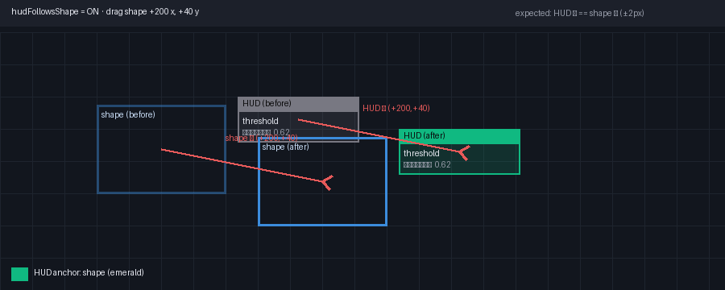
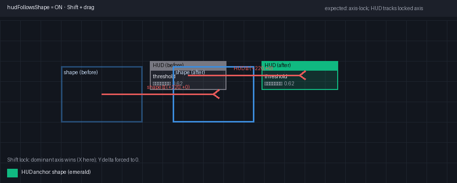
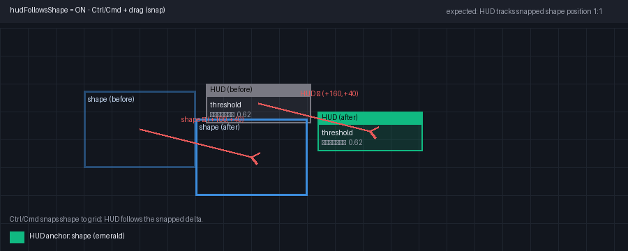
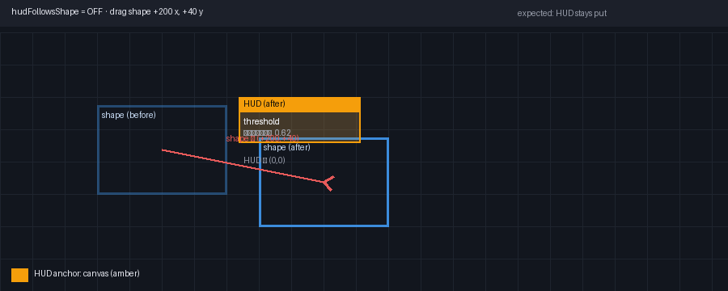
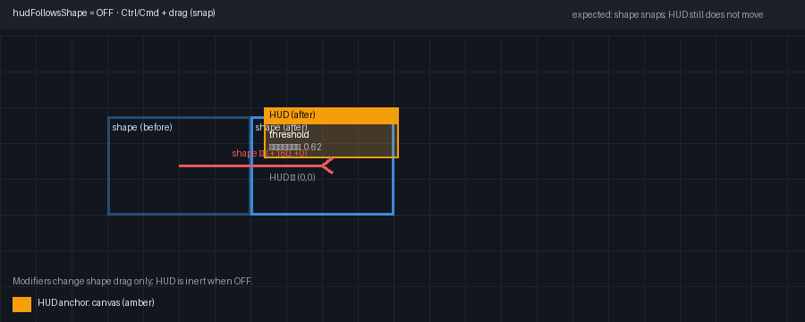
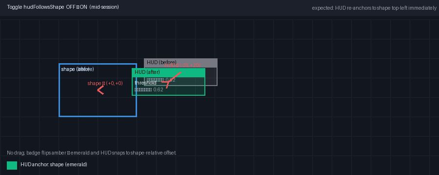

# HUD Drag Behavior: Verification Guide

Short operator/QA checklist for the SelectionOverlay quick-properties HUD under the `hudFollowsShape` preference. Pair with the Playwright regression `tests/e2e/hud_follows_shape_on_drag.py` and the debug badge (`data-testid="rule-hud-anchor-debug"`, enabled via `useUiPrefsStore.hudAnchorDebug`).

## Preconditions

1. Open the editor with a rule that renders quick properties (e.g. a `presence` controller).
2. Select the rule so the HUD renders.
3. (Optional) Toggle `hudAnchorDebug=true` to see the anchor badge (emerald=shape, amber=canvas, muted=default).

## Expected behavior matrix

| Action                                         | `hudFollowsShape = ON`                                                                                                                              | `hudFollowsShape = OFF`                                                                                                                |
| ---------------------------------------------- | --------------------------------------------------------------------------------------------------------------------------------------------------- | -------------------------------------------------------------------------------------------------------------------------------------- |
| Drag shape body                                | HUD translates 1:1 with the shape (delta matches NW-handle delta within 2 px). Badge: emerald "shape".                                              | HUD stays at its current canvas position; shape moves independently. Badge: amber "canvas" (or muted "default" if never repositioned). |
| Resize via NW/NE/SW/SE handle                  | HUD tracks the selection's top-left origin. Badge stays "shape".                                                                                    | HUD does not move. Badge stays "canvas"/"default".                                                                                     |
| Pan canvas (space+drag / middle-mouse)         | HUD moves with the canvas (it is a canvas-space overlay in both modes).                                                                             | Same: HUD moves with the canvas.                                                                                                       |
| Zoom in/out                                    | HUD scales position with canvas transform; on-screen offset from shape stays constant when ON.                                                      | HUD scales position with canvas transform; on-screen offset from shape changes as shape moves.                                         |
| Toggle `hudFollowsShape` OFF -> ON mid-session | HUD immediately re-anchors to the current shape's top-left (re-anchor `useEffect` in `SelectionOverlay.tsx:487-496`). Badge flips amber -> emerald. | n/a                                                                                                                                    |
| Toggle `hudFollowsShape` ON -> OFF mid-session | HUD freezes at its current canvas coords and no longer tracks the shape. Badge flips emerald -> amber.                                              | n/a                                                                                                                                    |
| User drags the HUD itself by its header        | HUD position persists as an offset relative to the shape's top-left. Continues to track on subsequent shape drags.                                  | HUD position persists as absolute canvas coords. Does not track shape drags.                                                           |
| Deselect + reselect same rule                  | HUD reappears at the persisted shape-relative offset.                                                                                               | HUD reappears at the persisted canvas position.                                                                                        |
| Select a different rule                        | HUD re-anchors to the new selection's top-left with the same relative offset.                                                                       | HUD stays at its last canvas position (does not follow selection changes).                                                             |

## Keyboard modifiers during drag

These modifiers apply to shape drag; the HUD follows per the table above.

| Modifier            | Effect on shape drag                                    | Effect on HUD (ON)                       | Effect on HUD (OFF)          |
| ------------------- | ------------------------------------------------------- | ---------------------------------------- | ---------------------------- |
| (none)              | Free move                                               | Tracks 1:1                               | No move                      |
| `Shift`             | Axis-lock to dominant axis (X or Y)                     | Tracks 1:1 along the locked axis         | No move                      |
| `Alt` / `Option`    | Duplicate-drag: leaves original in place, drags a clone | Tracks the clone (the new selection)     | No move                      |
| `Ctrl` / `Cmd`      | Snap to grid / snap points                              | Tracks the snapped position 1:1          | No move                      |
| `Ctrl+Shift`        | Snap + axis-lock combined                               | Tracks the snapped, axis-locked position | No move                      |
| `Esc` (during drag) | Cancel drag, restore original bounds                    | Snaps back with the shape                | No move (stays where it was) |

## Non-drag HUD hotkeys (reference)

| Shortcut       | Effect                                                               |
| -------------- | -------------------------------------------------------------------- |
| `Ctrl+L`       | Focus address bar (does not affect HUD).                             |
| `Ctrl+Shift+E` | Toggle Error History drawer (does not affect HUD).                   |
| `Ctrl+.`       | Command palette; `cmd:toggle-hud-follows-shape` flips the pref live. |

## Before/after reference visuals

Ghost outline = before drag, solid = after. Red arrows show the delta. Bottom-left swatch is the anchor-debug badge color.

| Scenario                                     | Reference                           |
| -------------------------------------------- | ----------------------------------- |
| `hudFollowsShape = ON`, plain drag           | `assets/hud-on-drag.png`            |
| `hudFollowsShape = ON`, `Shift` (axis-lock)  | `assets/hud-on-shift-axis-lock.png` |
| `hudFollowsShape = ON`, `Ctrl`/`Cmd` (snap)  | `assets/hud-on-ctrl-snap.png`       |
| `hudFollowsShape = OFF`, plain drag          | `assets/hud-off-drag.png`           |
| `hudFollowsShape = OFF`, `Ctrl`/`Cmd` (snap) | `assets/hud-off-ctrl-snap.png`      |
| Toggle `OFF -> ON` mid-session (re-anchor)   | `assets/hud-toggle-off-to-on.png`   |

These are schematic references (deterministic, no live-app dependency) intended for fast eyeball comparison against the real editor. For pixel-accurate confirmation, run `tests/e2e/hud_follows_shape_on_drag.py`.

## Quick manual smoke (30 seconds)

1. Select a `presence` rule. Confirm HUD renders with a threshold row.
2. Enable `hudAnchorDebug`. Badge should read "default" or "shape".
3. With `hudFollowsShape=ON`, drag the shape 100 px right. HUD should move ~100 px right. Badge: emerald.
4. Toggle `hudFollowsShape=OFF`. Drag shape 100 px down. HUD should NOT move. Badge: amber.
5. Toggle back ON. HUD should immediately re-anchor onto the new shape position. Badge: emerald.

If any row above fails, capture the anchor-badge value and the `hudPos` object from `useUiPrefsStore` and file against Issue #33.
