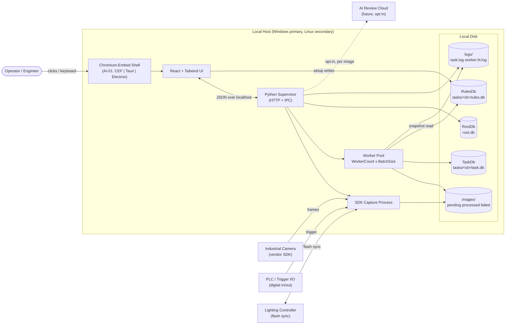

# System Context

Boundary view of the Vision Inspection app: who talks to what, and what leaves the machine.

## Diagram

## Trust Boundaries

- **Machine boundary:** Everything inside `Host` is trusted. Nothing crosses the boundary by default.
- **Camera SDK:** Trusted binary running in its own process; capture process isolates it from workers.
- **PLC/IO:** Physical wire; treated as untrusted input — every trigger is validated before act.
- **AI Cloud (future):** Untrusted network. Opt-in per operator; image redaction hooks per Step 41 (`44-security-privacy.md`).

## Data Egress

- **Default:** none. All Judgments, Images, and Logs stay on disk.
- **Opt-in only:** AI Review may upload one image + failed-rule context per submission (`AI-02`). No bulk upload path.
- **Export:** Operator-initiated CSV/JSON export via Results screen (Step 34). Local file only, no auto-transmit.

## Failure Domains

- Camera SDK crash → capture process restart, Task marked `DEGRADED` in RootDb.
- Worker crash → dispatcher requeues image up to N retries then moves to `failed/`.
- Disk full → capture halts current Task, `ErrorEvent` logged to RootDb, UI banner surfaces.
- UI process crash → backend keeps running; reopening shell re-attaches over localhost.

## Non-Actors (out of scope this pass)

- No multi-host cluster.
- No remote operator (VNC/RDP allowed by IT, not spec'd).
- No mobile client.

## Cross-Refs

- Runtime processes detail → Step 11 `11-runtime-processes.md`.
- Split-DB layout → `03-split-db-digest.md`.
- Config defaults → `04-seedable-config-digest.md`.
- Open questions → `spec/22-app-issues/01-vision-inspection-ambiguities.md` (`AI-01`, `AI-02`, `AI-06`).

## Acceptance Checklist

- [ ] External actors (operator, device, cloud AI, audit backend) enumerated with trust boundaries.
- [ ] Every context edge cites a contract spec (67, 68, 69, 71, 72).
- [ ] No PII crosses the boundary without appearing in `spec/21-app/44-security-privacy.md`.
