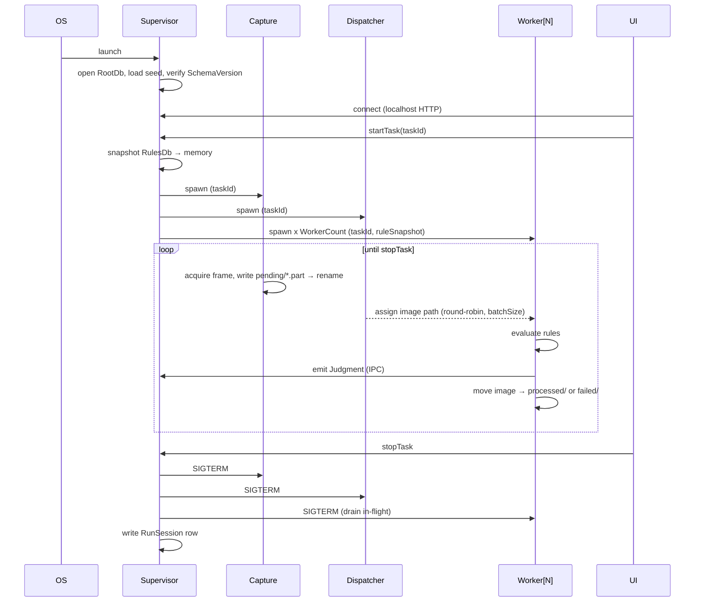

# Runtime Processes

Four long-running OS processes plus a short-lived UI shell. Each row of the table is authoritative for that process; anything not listed is out of scope for it.

## Process Table

| #   | Process        | Binary                        | Lifetime               | Spawns  | Owns                               | Reads                                           | Writes                                                                          |
| --- | -------------- | ----------------------------- | ---------------------- | ------- | ---------------------------------- | ----------------------------------------------- | ------------------------------------------------------------------------------- |
| 1   | **Supervisor** | `python -m app.supervisor`    | Boots first, dies last | 2, 3, 4 | HTTP loopback API, IPC bus         | RootDb, Seed config                             | RootDb, `logs/supervisor.log`                                                   |
| 2   | **Capture**    | `python -m app.capture`       | Per active Task        | —       | Camera SDK handle, trigger I/O     | Camera frames                                   | `images/pending/*.part` → final, `logs/capture.log`                             |
| 3   | **Worker[N]**  | `python -m app.worker --id N` | Pool of `WorkerCount`  | —       | Rule evaluator, one DB writer slot | `images/pending/`, RulesDb snapshot (in-memory) | TaskDb (Judgment), `images/processed/` or `images/failed/`, `logs/worker-N.log` |
| 4   | **Dispatcher** | `python -m app.dispatcher`    | Per active Task        | —       | Pending queue watcher              | `images/pending/` inotify                       | IPC: worker assignments                                                         |
| 5   | **UI Shell**   | Chromium-embed (AI-01)        | Operator session       | —       | DOM, keyboard                      | Supervisor HTTP                                 | RulesDb (setup mode) via Supervisor                                             |

## Lifecycle

## Rules

- **One writer per DB** (see split-db digest). Supervisor writes RootDb; each Worker writes TaskDb through a serialized queue owned by Supervisor.
- **Rule snapshot is immutable** for the life of a RunSession. Editing rules mid-run requires stopTask → snapshot → startTask.
- **Capture never blocks on processing.** Back-pressure surfaces as `queueDepth` metric, never as dropped frames — if disk fills, Task moves to `DEGRADED`, not silent loss.
- **Every process logs its own file** under `logs/`. Rotation policy in Step 38.
- **Crash policy:** Supervisor restarts Capture/Dispatcher/Worker up to 3× within 60 s; further failure marks Task `FAILED` and stops.

## IPC

- Transport: local Unix domain socket (Linux) / named pipe (Windows). JSON lines, one message per line.
- Messages: `AssignImage`, `JudgmentEmitted`, `WorkerHeartbeat`, `TaskStateChanged`, `ErrorEvent`.
- No shared memory. No cross-process locks — the filesystem `.part` rename is the only synchronization primitive on the hot path.

## Cross-Refs

- Data flow → Step 15 `15-processing-pipeline.md`.
- Worker pool sizing → Step 13 `13-worker-pattern.md`.
- Failure recovery → Step 37 `40-error-manage.md`.

## Acceptance Checklist

- [ ] Every process (UI, dispatcher, worker, supervisor) has a `Proc*` label per memory 09.
- [ ] IPC channels named with schema anchor to `spec/21-app/24-results-json.md` or migrations.
- [ ] Crash + restart semantics reference `spec/21-app/40-error-manage.md` tiers.
