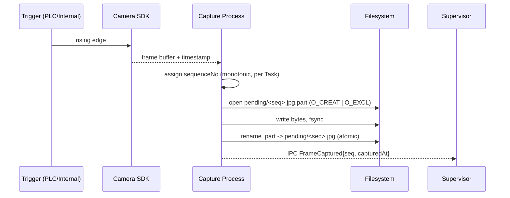

# Capture Pipeline

The SDK Capture process is the sole owner of camera frames. It writes atomically to `pending/` and never blocks on downstream work.

## Target

- **77 fps sustained** (Acceptance #1).
- Frame budget: **≤ 13 ms** end-to-end from trigger to `.part` rename.
- Zero silent drops. Frames the app cannot accept (queue full, disk full) → logged `ErrorEvent`, Task → `DEGRADED`.

## Sequence

## File Naming

- `pending/<sequenceNo>.<ext>` where `sequenceNo` = 9-digit zero-padded monotonic per Task (`000000001` … `999999999`).
- Temp suffix: `.part`. Dispatcher **must** ignore any file ending in `.part` — only the atomic rename makes an image visible.
- Extension: `.jpg` default; `.png` when `AppSetting.CaptureFormat=PNG`. Never a mixed Task.

## Atomicity

- POSIX/NTFS `rename()` is atomic within a filesystem — dispatcher never sees a half-written file.
- If write fails mid-way, `.part` is left behind for the reconciler (Step 15) to sweep at next boot; never renamed.

## Back-Pressure

- Capture watches `pending/` file count via a live counter (no `scandir` on hot path).
- Thresholds (defaults, tunable):
  - `pending ≥ 500` → warn (UI banner amber).
  - `pending ≥ 2000` → Task → `DEGRADED`, Capture pauses until `< 1500`.
- Disk-space guard: `< 500 MB free` on target volume → Capture halts current Task, `ErrorEvent(code=DISK_FULL)`.

## Trigger Sources (image 30, 32) — resolves Q-01

- **v1 default:** `SOFTWARE_TIMER` (internal software timer, ceiling 77 fps). Ships in v1.
- **v1 required:** `GPIO_EDGE` (PLC digital input, rising edge, debounced ≥ 1 ms). Ships in v1 — production installs cannot rely on software timing.
- **Manual:** UI button (setup / test only, never production).
- Selection lives per Task in `RulesDb.Config.TriggerMode`; enum values are the three above.
- Hardware abstraction: `capture/trigger/GpioEdgeSource` and `capture/trigger/SoftwareTimerSource` implement a common `TriggerSource` interface (`start()`, `stop()`, `onEdge(cb)`); Supervisor selects one per Task. Missing GPIO driver at boot → `E_CAP_TRIGGER_HW_UNAVAILABLE` and the Task refuses to start.

## Lighting Sync (image 31, 33)

- Capture sends a flash strobe pulse via SDK before/after exposure per Task config; lighting hardware is fire-and-forget (no ack loop).

## Failure Isolation

- Camera SDK crash → Capture process exits nonzero; Supervisor respawns (3× / 60 s policy); RunSession stays open unless respawn budget exhausted.
- Trigger flood beyond 77 fps → Capture drops SDK frames at source (SDK ring buffer), increments `dropCount` metric — never queues silently in RAM.

## Metrics

- `captureFps`, `pendingCount`, `dropCount`, `fsyncLatencyMs`, `renameLatencyMs`.

## Cross-Refs

- Downstream consumer → Step 15 `15-processing-pipeline.md`.
- Filesystem layout → Step 17 `20-folder-structure.md`.
- Config source → `04-seedable-config-digest.md`.
- Trigger + lighting UI → Steps 39 (settings), images 30–33.

## Acceptance Checklist

- [ ] Capture writes to `pending/` then renames to `processed/` atomically.
- [ ] SDK access wrapped by `VendorDeviceIO` facade per 52.
- [ ] Backpressure path returns `E_HW_TIMEOUT` or `E_CAP_*`, never silent drop.
