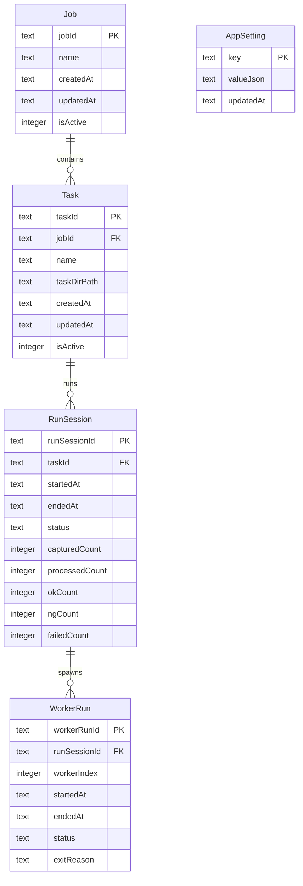

# 18 — Root DB Schema

**Status:** Locked (Plan 04 Step 18). Governs `backend/db/root.db`.

Conventions inherited from `02-db-conventions-digest.md`:

- PascalCase table names, camelCase column names.
- Booleans are affirmative (`isActive`, never `isNotActive`).
- All timestamps stored as ISO-8601 UTC TEXT (SQLite has no native `TIMESTAMPTZ`).
- Ids are ULIDs (26-char Crockford base32) unless noted.

## 1. Purpose

Root DB is the **catalog**. It knows every `Task`, every `Job`, every `RunSession`, every `WorkerRun`, and app-wide settings. It does NOT hold `Image`, `Region`, `Rule`, or `Judgment` — those live in per-Task DBs (see 22).

Single writer: **Supervisor**. Readers: Dispatcher (Task lookup), UI (all).

## 2. ER Diagram



## 3. Table Definitions

### 3.1 `Job`

Logical grouping of Tasks (e.g. one production line, one product family).

| Column      | Type                       | Notes                                |
| ----------- | -------------------------- | ------------------------------------ |
| `jobId`     | TEXT PK                    | ULID                                 |
| `name`      | TEXT NOT NULL              | Human label, unique per `isActive=1` |
| `createdAt` | TEXT NOT NULL              | ISO-8601 UTC                         |
| `updatedAt` | TEXT NOT NULL              | ISO-8601 UTC                         |
| `isActive`  | INTEGER NOT NULL DEFAULT 1 | 0/1; soft-delete flag                |

Index: `UNIQUE(name) WHERE isActive = 1`.

### 3.2 `Task`

A single inspection recipe. One `Task` = one `taskDirPath` under `backend/db/tasks/<TaskId>/`.

| Column        | Type                       | Notes                                              |
| ------------- | -------------------------- | -------------------------------------------------- |
| `taskId`      | TEXT PK                    | ULID; also the directory name                      |
| `jobId`       | TEXT NOT NULL              | FK → `Job.jobId`                                   |
| `name`        | TEXT NOT NULL              | Human label, unique per `jobId` where `isActive=1` |
| `taskDirPath` | TEXT NOT NULL              | Relative to install root, POSIX-style              |
| `createdAt`   | TEXT NOT NULL              |                                                    |
| `updatedAt`   | TEXT NOT NULL              |                                                    |
| `isActive`    | INTEGER NOT NULL DEFAULT 1 |                                                    |

Index: `UNIQUE(jobId, name) WHERE isActive = 1`; `INDEX(jobId)`.

### 3.3 `RunSession`

One execution of a Task (start → stop). Every `Judgment` in `task.db` carries this `runSessionId`.

| Column           | Type                       | Notes                                                      |
| ---------------- | -------------------------- | ---------------------------------------------------------- |
| `runSessionId`   | TEXT PK                    | ULID                                                       |
| `taskId`         | TEXT NOT NULL              | FK → `Task.taskId`                                         |
| `startedAt`      | TEXT NOT NULL              |                                                            |
| `endedAt`        | TEXT NULL                  | NULL while running                                         |
| `status`         | TEXT NOT NULL              | Enum: `RUNNING` \| `COMPLETED` \| `CANCELLED` \| `CRASHED` |
| `capturedCount`  | INTEGER NOT NULL DEFAULT 0 | Rolling counter                                            |
| `processedCount` | INTEGER NOT NULL DEFAULT 0 |                                                            |
| `okCount`        | INTEGER NOT NULL DEFAULT 0 |                                                            |
| `ngCount`        | INTEGER NOT NULL DEFAULT 0 |                                                            |
| `failedCount`    | INTEGER NOT NULL DEFAULT 0 | Pipeline failures (see 15 §4)                              |

Index: `INDEX(taskId, startedAt DESC)`; `INDEX(status) WHERE status = 'RUNNING'`.

### 3.4 `WorkerRun`

One worker process lifecycle within a `RunSession`. Enables per-worker post-mortem.

| Column         | Type             | Notes                                            |
| -------------- | ---------------- | ------------------------------------------------ |
| `workerRunId`  | TEXT PK          | ULID                                             |
| `runSessionId` | TEXT NOT NULL    | FK → `RunSession.runSessionId`                   |
| `workerIndex`  | INTEGER NOT NULL | 1..N where N = configured `WorkerCount`          |
| `startedAt`    | TEXT NOT NULL    |                                                  |
| `endedAt`      | TEXT NULL        |                                                  |
| `status`       | TEXT NOT NULL    | Enum: `RUNNING` \| `EXITED` \| `CRASHED`         |
| `exitReason`   | TEXT NULL        | Free text; short code from 15 §4 when applicable |

Index: `INDEX(runSessionId, workerIndex)`.

### 3.5 `AppSetting`

App-scoped key/value overrides (layer "App" per 04-seedable-config).

| Column      | Type          | Notes                                                 |
| ----------- | ------------- | ----------------------------------------------------- |
| `key`       | TEXT PK       | Dotted path, e.g. `worker.count`, `capture.targetFps` |
| `valueJson` | TEXT NOT NULL | JSON-encoded scalar/object                            |
| `updatedAt` | TEXT NOT NULL |                                                       |

No `isActive`. Deletion = revert to Seed layer.

### 3.6 `SchemaVersion`

One row. Owned by migration runner (per 26-migrations).

| Column      | Type          | Notes     |
| ----------- | ------------- | --------- |
| `version`   | INTEGER PK    | Monotonic |
| `appliedAt` | TEXT NOT NULL |           |

## 4. Enums (canonical values)

- `RunSession.status`: `RUNNING`, `COMPLETED`, `CANCELLED`, `CRASHED`.
- `WorkerRun.status`: `RUNNING`, `EXITED`, `CRASHED`.

Enums are enforced by CHECK constraints:

```sql
CHECK (status IN ('RUNNING','COMPLETED','CANCELLED','CRASHED'))
```

## 5. Write Rules

- Supervisor is the **only** writer. Dispatcher updates `RunSession` counters via a Supervisor RPC (per 11), not by opening `root.db` directly.
- `WAL` mode; `synchronous=NORMAL`; `busy_timeout=5000`.
- No triggers in v1. All derivations happen in Python.

## 6. Read Rules

- UI opens `root.db` in read-only WAL-reader mode. Never writes.
- Dispatcher opens `root.db` read-only to resolve `taskId → taskDirPath` at RunSession start; caches the path for the run.

## 7. Migrations

Initial migration is `000_root.sql`. All future changes are additive migrations `NNN_*.sql`, forward-only (per 26). No `ALTER TABLE DROP COLUMN` in v1.

## 8. Non-Goals

- No FK enforcement across DB files (SQLite scope).
- No cross-Task queries in `root.db`. Aggregation queries hit per-Task `task.db` files individually.
- No user or role tables in v1 (single-operator install per 44-security).

## Acceptance Checklist

- [ ] Root DB schema names match memory `09-enums-and-results-shape.md` casing.
- [ ] No Task DB tables leak into Root DB (`E_DB_SPLIT_VIOLATION`) — cross-check with 06.
- [ ] Every table has GRANT + RLS lines per `.lovable/coding-guidelines.md` public-schema rule.
