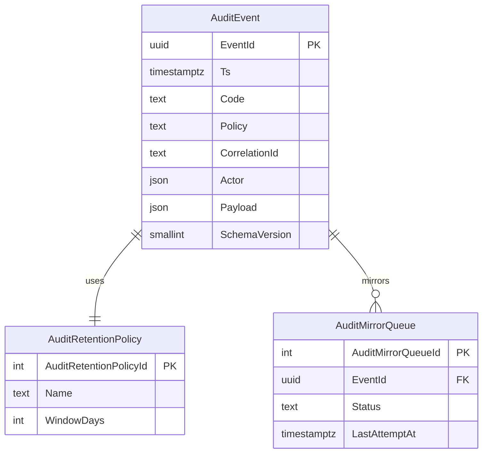

# Spec 72 - Audit Persistence (v2.0.5)

Status: columns-locked (Plan 21 Step 3 landed at v2.55.0). Columns in §72.3 and indexes in §72.4 are frozen; migration follows in Step 4.
Predecessor: [spec 71 - audit retention](./71-audit-retention.md)
Consumer: `app/core/audit/retention_worker.py`, `src/lib/audit-export.functions.ts`, `src/lib/audit-retention.functions.ts`

## §72.1 Purpose

Define the single persisted store for every audit event emitted by the Python HMI pipeline and by admin-write server functions, so that the retention worker (spec 71 §71.3) can compute real counters and `exportAuditBundle` (spec 71 §71.5) can stream deterministic bytes.

## §72.2 Storage target

- Primary: SQLite file `audit.db` under the runtime data directory (co-located with the results JSONL sink).
- Mirror (admin read only): `public.audit_events` in Supabase for `/ops` retention tile reads. No PII beyond `user_id` UUID and event payload as JSONB.

## §72.3 Column set (LOCKED, Plan 21 Step 3)

Frozen columns; any change requires a follow-up spec revision plus migration:

- `event_id` (uuid, PK)
- `ts` (timestamptz, not null, indexed)
- `code` (text, not null, indexed) e.g. `I_SEC_ADMIN_WRITE`, `AuditRetentionRun`, `AuditBundleExported`
- `policy` (text, not null) - one of `RetentionShort`/`RetentionStandard`/`RetentionLong`/`RetentionForensic` (resolved by `retention_worker.policy_for(code)`)
- `correlation_id` (text, not null) - 12-hex request id
- `actor` (jsonb) - `{userId?, role?, source: "server"|"worker"|"sink"}`
- `payload` (jsonb, not null) - event body
- `schema_version` (smallint, not null, default 1)

## §72.4 Indexes (LOCKED, Plan 21 Step 3)

- `(policy, ts DESC)` covering index for retention counters.
- `(ts ASC, event_id ASC)` covering index for `exportAuditBundle` stream sort.
- `(correlation_id)` btree for cross-event trace.

## §72.5 Grants and RLS (Supabase mirror)

- `GRANT SELECT ON public.audit_events TO authenticated` - filtered by admin RLS.
- `GRANT ALL ON public.audit_events TO service_role`.
- No `anon` grant.
- RLS: `USING (public.has_role(auth.uid(), 'admin'))` for SELECT; service_role bypasses.

## §72.6 Retention worker interface

Retention worker reads and deletes via SQLite only (source of truth). Supabase mirror is written by a service-role sink and never mutated from the client.

## §72.7 Export interface

`exportAuditBundle` reads from SQLite, streams JSONL in `(ts ASC, event_id ASC)` order, chunks to 4 MiB, aborts with `E_AUDIT_EXPORT_SIZE_CAP` at 256 MiB, computes payload sha256, and emits `AuditBundleExported` Ops event with `{ bundleId, bytes, count, sha256, correlationId }`.

## §72.8 Error taxonomy (adds to spec 71)

- `E_AUDIT_SINK_UNAVAILABLE` - sink self-test failed on boot.
- `E_AUDIT_SINK_WRITE_FAILED` - sink write rejected.
- `E_AUDIT_MIRROR_LAG` - Supabase mirror behind SQLite by more than 60s.

## §72.9 Open questions

- Encryption at rest for `audit.db` (deferred to v2.0.6 or later).
- Ed25519 signing rotation cadence (Plan 20 `[TBD]`).
- Cloud catalog audit routing (`RB-05`).

## §72.10 AuditPersistenceFacade binding

| Facade member                          | Source                                     | Output                        | Error code                                           |
| -------------------------------------- | ------------------------------------------ | ----------------------------- | ---------------------------------------------------- |
| `AppendEvent(event)`                   | SQLite transaction plus mirror queue write | stored `AuditEvent`           | `E_AUDIT_SINK_WRITE_FAILED`                          |
| `ReadWindow(query)`                    | SQLite covering indexes                    | ordered `AuditEvent[]` stream | `E_AUDIT_STORE_UNAVAILABLE`, `E_AUDIT_STORE_CORRUPT` |
| `DeleteExpired(policy, cutoff, limit)` | SQLite retention transaction               | deleted row count             | `E_AUDIT_RETENTION_LOCKED`                           |
| `MirrorPending()`                      | cloud mirror writer                        | mirror lag summary            | `E_AUDIT_MIRROR_LAG`                                 |
| `SelfTest()`                           | SQLite pragma and schema check             | health verdict                | `E_AUDIT_SINK_UNAVAILABLE`                           |

The facade is the only code path that opens `audit.db`. Retention, export, Ops, and mirror code call this facade instead of reading tables directly.

## §72.11 Contract back-links

| Target                                          | Required use                                                                                                      |
| ----------------------------------------------- | ----------------------------------------------------------------------------------------------------------------- |
| `spec/21-app/40-error-manage.md`                | Registers sink, store, mirror lag, corruption, and write-failure codes emitted by persistence.                    |
| `spec/21-app/27-config-surface.md`              | Confirms persistence path and retention/export settings are app-layer concerns, not task DB runtime overrides.    |
| `.lovable/memory/09-enums-and-results-shape.md` | Keeps audit event kinds and retention policy values PascalCase while allowing `E_*`, `W_*`, and `I_*` wire codes. |

## §72.12 Persistence ERD

## §72.13 Implementation checklist

- [ ] Plan 21 locks the final column set before implementation.
- [ ] SQLite migrations create covering indexes for retention and export.
- [ ] Public mirror migration grants authenticated select and service-role all access before enabling RLS.
- [ ] No anonymous access exists for audit mirror rows.
- [ ] Export streams rows in `(ts ASC, event_id ASC)` order.
- [ ] Mirror lag above 60 seconds emits `E_AUDIT_MIRROR_LAG`.
- [ ] Store corruption emits `E_AUDIT_STORE_CORRUPT` and blocks destructive retention deletes.

## Acceptance Checklist

- [ ] `AuditPersistenceFacade` binds `SinkSqlite` + `AuditMirrorWriter`.
- [ ] Every audit event kind is PascalCase per memory 09.
- [ ] Mirror failures degrade to local-only, emit `W_AUDIT_MIRROR_DEGRADED`, never drop the event.
