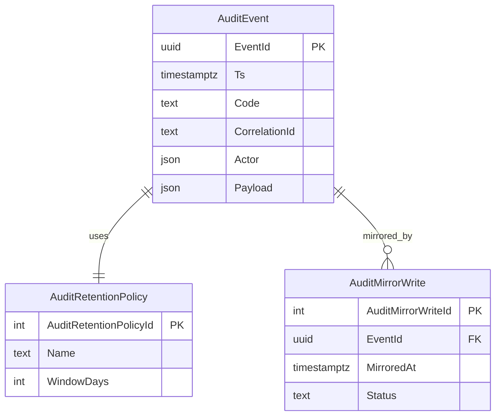

# SQL Coding Guidelines

Status: locked
Owner: Plan 22 Step 49 remediation
Applies to: SQLite migrations, cloud mirror migrations, persistence specs

## Required references

- `.lovable/coding-guidelines/coding-guidelines.md`
- `spec/04-database-conventions/00-overview.md`
- `spec/21-app/72-audit-persistence.md`
- `spec/21-app/40-error-manage.md` Appendix A

## Naming rules

1. Application entities use PascalCase names in specs.
2. Runtime JSON keys use PascalCase unless the target contract already locks camelCase.
3. SQLite tables may keep existing snake_case when preserving shipped files. New spec text must state the mapping.
4. Status, type, kind, and category values are named enums or join rows, never unbounded strings.

## Migration rules

1. Migrations must be idempotent.
2. Public mirror tables must include explicit grants in the same migration.
3. Auth-only tables do not grant anonymous access.
4. Role data lives in a separate `user_roles` table, never on a profile or user row.
5. Every migration that creates a table includes rollback notes or a forward-only recovery note.

## Public mirror grant template

```sql
CREATE TABLE public.AuditEventMirror (...);
GRANT SELECT ON public.AuditEventMirror TO authenticated;
GRANT ALL ON public.AuditEventMirror TO service_role;
ALTER TABLE public.AuditEventMirror ENABLE ROW LEVEL SECURITY;
CREATE POLICY "Admins can read audit mirrors"
ON public.AuditEventMirror
FOR SELECT
TO authenticated
USING (public.has_role(auth.uid(), 'admin'));
```

## Audit persistence ERD



## Acceptance checklist

- [ ] Every new public table has grants before RLS policies.
- [ ] Every table has primary key and required indexes.
- [ ] Every data-changing operation is transactional.
- [ ] Retention and export queries have covering indexes.
- [ ] Error paths map to registered `E_AUDIT_*`, `E_DB_*`, or `E_MIGRATION_*` codes.
